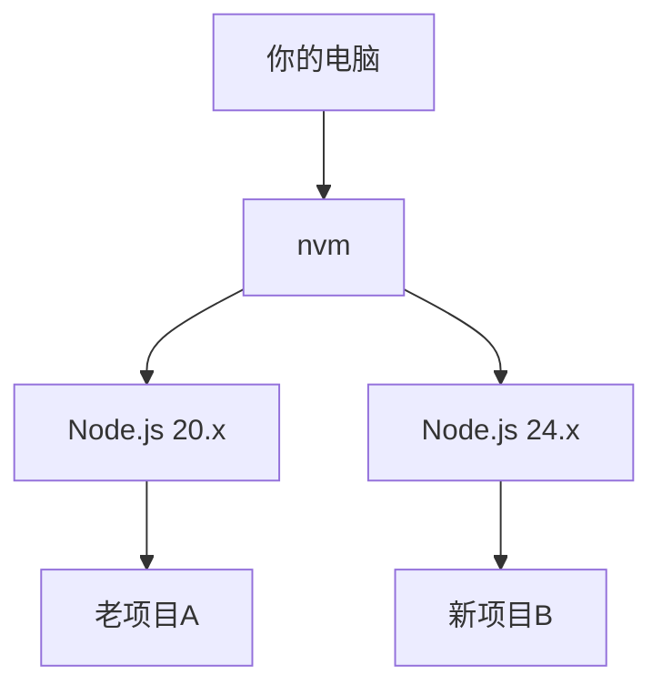

# 1.5 包管理与项目配置

> **阅读完本节后，你将会收获：**
> - 理解 nvm 和 pnpm 的工作原理
> - 掌握常用的 pnpm 命令（包括全局安装）
> - 理解 package.json、pnpm-lock.yaml 等核心配置文件的作用

::: tip 还没安装环境？

如果你还没有安装 Node.js 和 pnpm，请参考 [1.0 快速开始](./00-quick-start.md) 完成安装。

:::

## 基本概念

**Node.js** 是 JavaScript 运行时环境，让 JS 能在服务器端运行。现代前端构建工具都依赖它。

**LTS**（Long Term Support）是长期支持版本，比 Current 更稳定，推荐用于开发。

**nvm**（Node Version Manager）让你在同一台电脑上安装和切换多个 Node.js 版本。

**pnpm** 是包管理器，用于安装项目依赖。相比 npm，它更快、更节省磁盘空间。

## 为什么选择 pnpm？

| 特性 | npm | pnpm |
|------|-----|------|
| 速度 | 基准 | **快 2-3 倍** |
| 磁盘空间（10项目） | ~5GB | **~1.5GB** |

pnpm 使用**硬链接**让所有项目共享同一份依赖文件，而不是每个项目都复制一份。

## pnpm 常用命令

### 项目依赖命令

| 命令 | 作用 |
|------|------|
| `pnpm init` | 初始化项目 |
| `pnpm install` | 安装所有依赖 |
| `pnpm add xxx` | 安装生产依赖（xxx 替换为包名，如 React） |
| `pnpm add -D xxx` | 安装开发依赖（xxx 替换为包名，如 TypeScript） |
| `pnpm remove xxx` | 卸载包 |
| `pnpm dev` | 运行脚本（等同于 pnpm run dev） |

::: tip add 和 add -D 的区别？

- **add xxx**：生产依赖，项目运行时需要
- **add -D xxx**：开发依赖，仅开发时需要

不确定的话，让 AI 决定用哪个。

:::

### 全局安装命令

除了项目依赖，你还可以用 npm 安装**全局工具**——这些工具可以在电脑的任何位置使用：

```bash
# 安装全局 CLI 工具
npm install -g @anthropic-ai/claude-code
```

**全局安装 vs 项目安装**：

| | 全局安装 | 项目安装 |
|---|---------|---------|
| **命令** | `npm install -g xxx` | `pnpm add xxx` |
| **位置** | 系统目录，所有项目可用 | 当前项目的 node_modules |
| **用途** | CLI 工具（如 Claude Code） | 项目依赖（如 React） |
| **示例** | claude、http-server | react、lodash |

::: tip 什么时候全局安装？

- **CLI 工具**：如 Claude Code、http-server、create-react-app
- **系统级工具**：如 nrm（镜像源管理）、vercel（部署工具）

普通项目依赖（如 React、Vue）应该安装在项目内，不要全局安装。

:::

## 核心配置文件

**什么是配置文件？** 配置文件是记录项目元数据的纯文本文件，告诉包管理器这个项目需要什么依赖、如何运行。它们放在项目的**根目录**（最外层文件夹）下。

**为什么每个项目都有？** 因为每个项目依赖的第三方库不同——有的用 React，有的用 Vue；有的需要特定版本，有的需要最新版。配置文件记录了这些差异，确保任何人拿到代码后都能还原出相同的开发环境。

**为什么需要它们？** 想象一下没有配置文件的情况：你下载了一个开源项目，但不知道它需要什么依赖、怎么启动。配置文件解决了这个问题——`pnpm install` 会根据配置自动下载所有依赖，`pnpm dev` 知道如何启动项目。

### package.json

项目描述文件，记录依赖和脚本：

```json
{
  "dependencies": {
    "react": "^18.0.0"
  },
  "devDependencies": {
    "typescript": "^5.0.0"
  }
}
```

### pnpm-lock.yaml

自动生成的锁文件，记录每个依赖的精确版本。确保所有人安装的版本**完全一致**，避免"在我电脑上能跑"问题。

**注意事项**：
- 自动生成，**不要手动修改**
- 必须提交到 Git

### .nvmrc（可选）

指定项目推荐的 Node.js 版本：

```bash
# .nvmrc 文件内容
24
```

大多数项目没有这个文件，用最新 LTS 即可。有此文件时，运行 `nvm use` 自动切换。

## 拓展：什么时候需要 nvm？

::: tip 已经安装好了？

如果你按照 [1.0 快速开始](./00-quick-start.md) 完成了安装，nvm 已经安装好了（Mac/Linux 通过脚本自动安装，Windows 用户可选择安装）。

:::

不同项目可能需要不同版本的 Node.js：



**什么时候需要切换版本**：老项目维护、兼容性测试。大多数新项目用最新 LTS 即可。

## 常见问题

### Q: nvm 命令提示 `command not found`

需要重新加载配置或重启终端：

```bash
source ~/.zshrc   # 如果使用 zsh
source ~/.bashrc  # 如果使用 bash
```

### Q: 如何查看项目需要哪个 Node.js 版本？

查看 `package.json` 中的 `engines` 字段，或项目根目录的 `.nvmrc` 文件。

### Q: npm 项目可以迁移到 pnpm 吗？

可以，完全兼容：

```bash
rm -rf node_modules package-lock.json
pnpm install
```

> **这条命令做了什么**：删除 npm 的依赖文件夹和锁文件，然后用 pnpm 重新安装。

## 核心理念

**nvm 解决版本冲突，pnpm 提升安装效率**。

- ✅ 多项目可以使用不同 Node.js 版本
- ✅ pnpm 复用依赖，安装快速、节省空间
- ✅ pnpm 严格模式，避免"幽灵依赖"

## 相关内容

- 详见：[1.4 Terminal 终端入门](./04-terminal-basics.md)
- 详见：[nvm 中文官网](https://nvm.uihtm.com/)
- 前置：[1.0 快速开始](./00-quick-start.md)
- 前置：[1.2 技术栈概念](./02-tech-stack.md)
