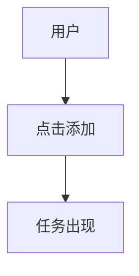

# 3.4 从 PRD 到代码 🟡

> **阅读完本节后，你将会收获：**
> - 理解 AI 如何"阅读"和执行 PRD
> - 掌握 PRD 细节如何影响生成代码质量
> - 学会使用可视化减少误解
> - 掌握"方案先行"的工作方法

> 序言中提到的：理解 AI 如何执行 PRD，能让 PRD 写得更有效。

---

## AI 的"阅读"方式

PRD 不是给人看的，是给 AI 看的。AI "阅读" PRD 的方式和人有根本差异。

### 人与 AI 的阅读差异

| 人的阅读方式 | AI 的阅读方式 |
|-------------|--------------|
| 从头到尾读一遍 | 把 PRD 分解成"信息块" |
| 跳过重复内容 | 每个字段都处理 |
| 会"脑补"模糊的地方 | 严格按字面意思理解 |
| 会主动问不清楚的地方 | 不问就按默认理解处理 |

**核心差异**：AI 不会"脑补"。你写的每个字都会影响它生成的代码。如果 PRD 有歧义，AI 要么猜测（可能猜错），要么停下来问（增加对话轮次）。

这种差异对 PRD 写作有深远的影响。当你为人类写文档时，你可以依赖一些"常识"——你知道读者会理解"登录功能"通常包含什么，不需要逐一列出用户名输入框、密码输入框、登录按钮。但 AI 没有这种"常识"，或者说，它的"常识"来自训练数据中的统计规律，可能与你的预期不符。对于 AI 来说，"登录功能"可能意味着简单的本地存储验证，也可能意味着完整的 OAuth 第三方登录流程。如果不明确指定，AI 会随机选择一种实现，而你只能在看到结果后才知道它"猜"的是哪一种。

### AI 的执行流程

当把 PRD 给 AI 后，AI 内部经历以下步骤：


这个流程是自动发生的。PRD 质量直接决定每个步骤的准确性。

理解这个流程有助于你预判 AI 的行为。当你知道 AI 首先会提取关键信息时，你就会特别注意 PRD 开头部分的清晰性；当你知道它会构建数据模型时，你就会确保数据相关的描述是完整和一致的。每一个步骤都是潜在的失败点，也是你可以通过改进 PRD 来优化的点。如果最终生成的代码有问题，回溯这个流程可以帮助你定位问题出在哪个阶段——是信息提取阶段的误解，还是数据模型设计阶段的偏差。

---

## PRD 细节如何影响代码

### 提取关键信息阶段

AI 从 PRD 中提取：
- 用户是谁 → 影响 UI 设计风格
- 核心功能 → 决定代码结构
- 业务流程 → 决定逻辑顺序
- Out-of-Scope → 防止"自由发挥"

如果 PRD 写得太模糊，AI 会按"常见做法"猜测，可能猜错。

### 构建数据模型阶段

AI 根据 PRD 中的"数据"相关描述，设计数据结构：

| PRD 中的描述 | AI 理解的数据结构 |
|-------------|------------------|
| "任务有标题、完成状态" | `{ title: string, completed: boolean }` |
| "用户可以添加多个任务" | `tasks: Array<Task>` |
| "数据需要保存" | 需要 localStorage 或数据库 |

如果 PRD 没说需要保存什么数据，AI 可能漏掉关键字段，后期需要重构数据结构。

数据模型的设计是架构的基础，一旦确定，后续的很多决策都会围绕它展开。如果 AI 在这个阶段产生了误解，比如把应该关联的数据设计成了独立表，或者漏掉了某个关键字段，这种错误会在后续阶段被放大。前端代码会基于错误的数据结构来渲染，后端接口会基于错误的模型来查询，整个系统的数据流都会受到影响。修正这种错误不仅仅是改几行代码那么简单，往往需要重新设计数据库 schema、修改 API 契约、调整前端组件。这种重构的成本，远高于在 PRD 阶段多写几句话来明确数据需求。

### 设计业务逻辑阶段

AI 根据 PRD 中的流程图和交互描述，编写代码逻辑：

| 交互描述 | AI 生成的代码逻辑 |
|---------|------------------|
| "点击添加按钮，任务出现在列表" | `handleAddTask()` 函数 |
| "点击勾选，任务显示删除线" | `toggleTask()` + CSS 样式 |
| "快速点击防抖" | `debounce()` 或 `disabled` 状态 |

如果 PRD 没写边缘情况，AI 可能不做防抖、不做错误处理。

---

## PRD 质量决定代码质量

### 例子1：没写 Out-of-Scope

**PRD**：
```markdown
# 待办清单
用户可以添加任务、勾选完成。
```

**AI 可能生成**：
- 登录功能
- 云同步
- 分类标签

结果：代码比预期的复杂得多。

这种"过度实现"是 AI 开发中最常见的问题之一。AI 的训练数据包含了大量功能完整的企业级应用，它学会了"一个待办清单应该有什么"。当你没有明确说不的时候，AI 会默认按照这种"完整版"来实现。这不是 AI 的错——它只是在尽其所能地满足你的需求。问题在于，你的需求描述中缺少了边界信息。Out-of-Scope 的价值不仅在于告诉 AI 不要做什么，更在于帮助 AI 理解你的真实意图。当你说"不要登录注册"时，AI 理解到这是一个本地工具；当你说"不要云同步"时，AI 理解到数据不需要跨设备共享。这些否定性的约束，实际上是在为 AI 划定一个清晰的创作空间。

**修正后的 PRD**：
```markdown
# 待办清单

## 核心功能
- 添加任务
- 勾选完成

## Out-of-Scope
- 不要登录注册
- 不要云同步
- 不要分类标签
```

### 例子2：没写边缘情况

**PRD**：
```markdown
用户可以点击添加按钮添加任务。
```

**AI 生成的代码**：
```javascript
function addTask() {
  tasks.push(newTask);
}
```

问题：快速点击会重复添加。

**修正后的 PRD**：
```markdown
用户点击添加按钮添加任务。

边缘情况：快速点击防抖，0.5秒内只响应一次。
```

**AI 生成的代码**：
```javascript
function addTask() {
  if (isAdding) return; // 防抖
  isAdding = true;
  tasks.push(newTask);
  setTimeout(() => isAdding = false, 500);
}
```

---

## AI 理解 PRD 的盲区

AI 有一些理解盲区，写 PRD 时要注意。

### 盲区1：默认值

| 你写的 | AI 理解的默认值 |
|--------|---------------|
| "显示任务列表" | 列表最多显示多少条？AI 可能猜 10、50、100 |
| "按钮点击后..." | 按钮要禁用吗？AI 可能不处理 |
| "数据保存" | 保存多久？AI 可能猜"永久" |

**解决方案**：明确写出期望的默认值。

默认值的问题之所以重要，是因为它反映了 AI 和人类在"常识"上的差异。对于人类来说，"显示任务列表"默认意味着"显示所有任务"，"数据保存"默认意味着"永久保存"。但 AI 没有这种默认假设，或者更准确地说，它的默认假设来自统计学习，可能与你的直觉不同。当 AI 猜测"列表最多显示多少条"时，它可能会选择 10（因为移动端常见）、50（因为是一个"合理"的数字）、或者 100（因为是一个"安全"的上限）。这些选择都是"合理"的，但可能都不是你想要的。明确写出期望的默认值，实际上是在把你的"常识"传递给 AI。

### 盲区2：状态变化

| 你写的 | AI 可能误解 |
|--------|-----------|
| "任务可以勾选完成" | 勾选后是删除线？移到底部？还是消失？ |
| "加载中..." | 加载中按钮要禁用吗？要显示转圈吗？ |

**解决方案**：用状态描述："初始状态 → 触发 → 加载中 → 成功/失败"。

### 盲区3：优先级

| 你写的 | AI 可能误解 |
|--------|-----------|
| 列了一堆功能 | AI 可能按列出的顺序全部实现 |
| 没说哪些重要 | AI 可能把次要功能做得太复杂 |

**解决方案**：用 P0/P1/P2 标注优先级。

---

## 让 AI 更好地理解 PRD

### 技巧1：用结构化格式

AI 对 Markdown 结构有很好的理解。

结构化的列表：
```markdown
## 核心功能
- 功能1
- 功能2

## Out-of-Scope
- 不要xxx
- 不要yyy
```

比纯文字段落更清晰。

### 技巧2：具体而非抽象

不要说"界面要好看"，要说"白色背景，蓝色按钮，无边框圆角"。

不要说"要流畅"，要说"点击后 0.5 秒内响应"。

具体描述无法有多种解读。

抽象的形容词是 PRD 写作中的陷阱。"好看"、"流畅"、"简洁"这些词听起来很专业，但每个人对它们的理解都不同。你认为"好看"是极简主义的白底黑字，AI 可能理解为渐变背景和圆角卡片；你认为"流畅"是 0.5 秒内响应，AI 可能理解为有优雅的过渡动画。这种理解的差异不会导致代码错误，但会导致产品感觉不对。具体描述的价值在于它消除了所有解释的空间。当你说"白色背景，蓝色按钮，无边框圆角"时，AI 可以精确地翻译成 CSS 代码；当你说"点击后 0.5 秒内响应"时，AI 知道需要优化性能或者添加加载状态。

### 技巧3：用 Mermaid 流程图

AI 能"看懂" Mermaid 流程图：



这比文字描述更准确。

---

## 方案先行，实现为后

一个有效的实践是：**让 AI 先输出技术方案，再写代码**。

> 请先给出这个功能的技术实现方案，包括数据结构、接口定义、主要步骤。我确认后你再写代码。

这样做的好处：

| 直接让 AI 写代码 | 先让 AI 输出方案 |
|-----------------|-----------------|
| AI "边想边写"，容易逻辑断层 | AI 先捋清思路，有明确锚点 |
| 有误解返工量大 | 方案阶段就能发现问题 |
| 代码质量不可控 | 方案确认后再写，更稳定 |

这是"思维链"的应用——把复杂任务拆成"先想清楚再动手"两步。

这种分阶段的思维方式对于复杂任务尤为重要。当 AI 被要求直接生成代码时，它必须在同一时间处理多个层面的问题：整体架构、模块划分、接口设计、具体实现。这种多任务并行容易导致思维混乱，某些关键细节可能被遗漏。而方案先行把这些问题分离开来：第一阶段只关注"做什么"和"怎么做"，不考虑具体语法；第二阶段只关注"怎么写"，在已经确定的框架内填充代码。这种分离让每个阶段的认知负荷降低，质量相应提高。更重要的是，方案阶段提供了一个"检查点"，让你能够在投入大量时间之前发现并纠正方向性的错误。

---

## 常见问题

### Q1: AI 没按 PRD 生成代码

**A**: 检查 PRD 是否给了 AI，检查 PRD 路径是否正确，检查是否被截断。AI 可能只"看到"了部分 PRD。

### Q2: 生成的代码与 PRD 不符

**A**: 这可能是理解偏差。用 3.2 的确认模板让 AI 重新确认理解，或者使用"方案先行"方法。

### Q3: PRD 要写多详细才能让 AI 准确理解？

**A**: 原则是：AI 读了之后，不需要再问"这个按钮放哪"、"失败时怎么处理"这类问题。不同阶段的稿次详细程度不同，详见 3.3。

### Q4: 可以让 AI 边写边补充 PRD 吗？

**A**: 不推荐。这会导致 PRD 和代码不同步，后续难以维护。正确做法是先完善 PRD，再生成代码。

---

## 本节核心要点

- ✅ AI 严格按 PRD 字面意思理解，不会"脑补"
- ✅ PRD 每个字段都会影响 AI 生成的代码
- ✅ 没写 Out-of-Scope → AI 可能"自由发挥"
- ✅ 没写边缘情况 → AI 可能不做错误处理
- ✅ AI 有理解盲区：默认值、状态变化、优先级
- ✅ 用结构化格式、具体例子、Mermaid 流程图让 AI 更准确理解
- ✅ **方案先行** — 让 AI 先输出技术方案，确认后再写代码

第三章学完了。接下来第四章：开发常识与技术栈。

---

## 相关内容

- 前置：[3.3 PRD 编写实战](./03-prd-template-guide.md)
- 详见：[第四章：开发常识与技术栈](../04-dev-fundamentals/index.md)
