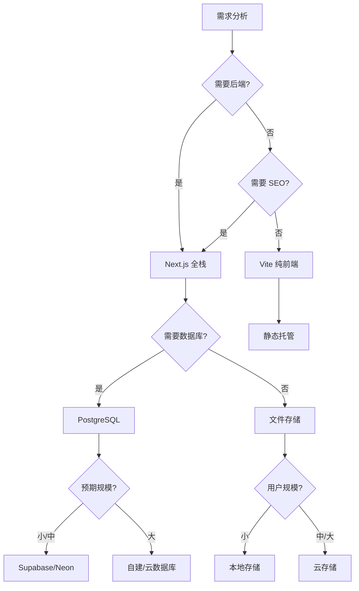

# 4.1 技术栈决策框架 🟡

> **阅读完本节后，你将会收获：**
> - 理解技术栈决策的核心原则
> - 掌握"需求优先"的选型思维
> - 学会评估技术方案的可行性和复杂度
> - 了解常见技术方案的适用场景

> PRD 确定后再进行技术栈选型，先搞清楚要做什么，再决定用什么做。

---

## 技术栈决策的核心原则

技术栈决策是产品开发的关键节点。选择合适的技术能让开发事半功倍，选错技术则会增加不必要的复杂度。

很多人在选择技术时容易陷入"技术崇拜"——追求最新、最酷的技术，而忽略了实际需求。这种思维方式在 AI 时代尤其危险，因为 AI 对主流、成熟的技术支持最好，冷门技术可能导致 AI 无法准确理解代码或生成错误的实现方案。

技术栈决策的核心原则是：**明确需求 → 评估复杂度 → 选择最小可行方案**。

理解技术栈的演进逻辑有助于做出更明智的选择。编程语言和技术框架的发展呈现出明显的"分层叠加"特征，每一层都在前一层的基础上提供更强大的抽象能力。

### 编程语言的世界

想象一下你走进一家餐厅，菜单上有几十种不同的菜肴。编程语言的世界也是如此——有数十种语言可供选择，每一种都有自己的特色和适用场景。了解这些语言的故事，能帮助你理解为什么某些技术会成为特定领域的首选。

**C 和 C++** 是计算机世界的基石。它们诞生于操作系统需要直接与硬件对话的年代。如果你想开发一个需要极致性能的游戏引擎，或者编写运行在嵌入式设备上的代码，C/C++ 仍然是最佳选择。Linux 操作系统、Windows 内核、大多数游戏引擎都建立在它们之上。但代价是开发效率较低——你需要手动管理内存，处理很多底层细节。

**Java** 在企业级世界占据主导地位。"一次编写，到处运行"的承诺让它成为大型系统的首选。阿里巴巴、京东的后端系统，银行的核心业务，大多运行在 Java 之上。它提供了成熟的生态系统和严格的类型安全，但也意味着更冗长的代码和更慢的开发周期。

**Python** 是数据科学家的最爱。它的语法简洁优雅，让科学家和研究人员能够快速验证想法。Instagram 和 YouTube 的后端都有 Python 的身影，OpenAI 的模型训练也大量使用 Python。但 Python 的前端能力较弱，如果你想做全栈开发，还需要学习另一套技术。

**Go** 由 Google 开发，专为云原生时代设计。Docker 和 Kubernetes 都是用 Go 编写的。它的并发模型优雅，编译速度快，适合构建高性能的网络服务。字节跳动等公司在后端大量使用 Go。

**Rust** 是系统编程领域的新星。它承诺提供 C++ 级别的性能，同时保证内存安全。Firefox 浏览器、Discord 的某些组件、Cloudflare 的基础设施都在使用 Rust。但学习曲线较陡，不适合快速原型开发。

**JavaScript 和 TypeScript** 统治了 Web 世界。最初只是浏览器中的脚本语言，但随着 Node.js 的出现，它扩展到了服务器端。TypeScript 在 JavaScript 基础上增加了类型系统，让大型项目的维护变得更加容易。Netflix、Stripe、Vercel 都建立在 TypeScript 生态之上。

### 我们的选择：为什么是 TypeScript + Next.js？

面对这么多选择，你可能会问：为什么本教程选择 TypeScript + Next.js？

让我们从实际需求出发。假设你是一个独立开发者，或者在一个小团队中，你的目标是快速验证一个产品想法。你需要一个技术栈，能够同时处理前端界面和后端逻辑，学习曲线不能太陡，而且要有丰富的社区支持。

C/C++/Rust 首先被排除。它们太底层了，你需要处理内存管理、编译优化等细节，这些对于快速做产品来说是巨大的时间成本。

Java 和 Go 是优秀的后端语言，但你需要单独学习前端技术。这意味着两套工具链、两套思维方式、两套部署流程。对于小团队来说，这种复杂度是不必要的负担。

Python 是数据科学的首选，但它在浏览器中无法运行。如果你想做 Web 应用，需要额外学习 JavaScript 来处理前端，又回到了两套技术的问题。

PHP 和 Ruby 曾经是 Web 开发的热门选择，但它们的生态正在萎缩。更重要的是，AI 模型对它们的训练数据不如 JavaScript 丰富，这意味着 AI 生成的代码质量可能不够稳定。

TypeScript 的独特之处在于它统一了前后端。你用同一种语言写前端界面和后端 API，类型定义可以在两端共享。当你让 AI 帮你生成代码时，它不需要在不同语言范式之间切换，生成的代码更加一致和准确。

Next.js 进一步简化了全栈开发。它把 React 前端、API 路由、数据库连接、部署流程都整合在一起。你不需要配置复杂的构建工具，不需要处理跨域问题，甚至不需要管理服务器——Vercel 可以一键部署。

这就是为什么我们选择 TypeScript + Next.js。它不仅是一个技术选择，更是 AI 时代个人开发者最高效的生产方式。

---

## AI 时代的技术栈选择

在 AI 辅助开发时代，技术栈选择有了新的考量维度。想象你在和一个见多识广但偶尔会说胡话的助手合作——AI 友好度描述的就是这个助手对某项技术的熟悉程度。主流技术如 JavaScript、Python 拥有庞大的训练数据，AI 知道它们的最佳实践和常见陷阱；而冷门技术或新出现的框架，AI 可能会"编造"不存在的 API。

当你使用统一的技术栈时，AI 的上下文理解会更连贯。如果你前端用 React，后端用 Python，数据库用 MongoDB，AI 需要在三种不同的技术范式之间切换，很容易产生理解偏差。而统一使用 TypeScript 生态——Next.js 做前后端，PostgreSQL 做数据库——AI 可以在一个连贯的上下文中工作，生成的代码更加一致和准确。类型定义在前后端共享，AI 不会搞错字段名；AI 能一次性理解整个项目，生成跨组件的代码。这些看似小的改进，累积起来会显著提升开发效率。

过去，技术选型往往是一个权衡游戏：选择 Java 意味着企业级稳定但开发缓慢；选择 Python 意味着快速开发但性能受限；选择 JavaScript 意味着全栈统一但类型不安全。TypeScript 和 Next.js 的组合打破了这种权衡——它提供了企业级的类型安全，实现了全栈的统一语言，适配 AI 时代，释放了个人开发者的生产力。这就是为什么本教程选择 TypeScript + Next.js 作为核心技术栈。

---

## 决策框架：三个问题

面对技术选型时，回答这三个问题可以快速缩小范围：

**问题一：这个项目本质上需要做什么？**

- 展示内容为主 → 静态站点或纯前端框架
- 需要用户登录 → 需要后端能力
- 需要持久化存储 → 需要数据库
- 需要 AI 能力 → 需要集成 AI API

**问题二：用户规模和并发量预期是多少？**

- 个人使用或小规模 → 可以选择简单方案
- 预期中等规模 → 需要考虑扩展性
- 预期大规模 → 需要架构设计

**问题三：团队（或个人）的技术背景是什么？**

- 熟悉 JavaScript/TypeScript → 选 Next.js
- 熟悉 Python → 选 FastAPI/Flask
- 全新学习 → 选择 AI 支持最好的技术栈

---

## 常见技术方案速查

### 前端框架

| 方案 | 适用场景 | 不适用场景 |
|------|---------|-----------|
| **Next.js** | 需要后端、SEO、全栈开发 | 纯静态展示 |
| **Vite + React** | 纯前端、SPA 应用 | 需要 SSR/SEO |
| **纯 HTML/CSS** | 极简静态页面 | 交互复杂的应用 |

::: tip 为什么推荐 Next.js？

- AI 对其项目结构理解深入，代码生成准确
- 支持全栈开发，前后端统一技术栈
- 部署便捷（Vercel 一键部署）
- 生态成熟，问题解决方案丰富

:::

### 数据库

| 方案 | 适用场景 | 不适用场景 |
|------|---------|-----------|
| **PostgreSQL** | 关系型数据、需要事务 | 极简键值存储 |
| **Supabase** | 快速开发、需要认证/存储 | 需要完全自定义后端 |
| **Neon** | 无服务器架构、轻量需求 | 需要完整后端功能 |
| **SQLite** | 本地开发、极简需求 | 多用户并发写入 |

::: tip 为什么推荐 PostgreSQL？

PostgreSQL 是最强大的开源数据库：
- 关系型 + JSONB + pgvector 扩展
- 既能处理结构化数据，也能存储半结构化数据
- 支持向量搜索，适合 AI 应用
- AI 对其理解深入，能生成准确的数据模型代码

:::

### 部署方案

| 方案 | 适用场景 | 特点 |
|------|---------|------|
| **Vercel** | Next.js 项目、全球分发 | 零配置部署，自动 CI/CD，Edge Functions 支持 |
| **EdgeOne Pages** | 需要国内节点、边缘计算 | 腾讯云全球加速，支持 Pages Functions 和 Node.js 运行时 |
| **云服务器** | 完全控制、复杂应用 | 需要自行配置环境和运维 |
| **Docker** | 需要环境一致性、多服务架构 | 容器化打包，确保开发与生产环境一致 |

::: tip Vercel vs EdgeOne Pages

**Vercel** 是 Next.js 的原生部署平台，提供：
- 零配置自动部署，与 Git 仓库无缝集成
- 全球 CDN 加速，静态资源自动分发
- Serverless Functions 和 Edge Functions 支持
- 免费额度 generous，适合个人项目和小团队

**EdgeOne Pages** 是腾讯云推出的边缘部署平台：
- 国内节点覆盖，适合需要中国大陆加速的场景
- 支持 Pages Functions（边缘计算）和 Node.js 运行时
- 提供 KV 存储，支持全栈应用开发
- 与腾讯云生态（SSL 证书、CDN 等）深度集成

选择建议：主要用户在国内选 EdgeOne Pages；需要全球分发或深度使用 Next.js 选 Vercel。

:::

---

## 不同规模公司的技术栈选择

技术选型往往与公司规模和业务特点相关：

| 公司规模 | 技术栈 | 选择原因 |
|---------|--------|---------|
| **初创公司** （0-50人） | Next.js + PostgreSQL + Vercel | 开发速度快、统一技术栈、AI 友好、部署简单 |
| **中型公司** （50-500人） | Java/Go 后端 + React 前端 + 云数据库 | 性能可控、人才储备充足、可维护性好 |
| **大型公司** （500人以上） | 多语言并存：Java（电商）、Go（云原生）、C++（性能敏感） | 不同业务线选择最适合的技术、基础设施团队自研框架 |

---

## 技术原理补充（选读）

如果你想更深入理解技术背后的原理，可以阅读以下内容。这些知识对开发不是必须的，但有助于理解技术选型的逻辑。

### 编译型 vs 解释型

理解语言的执行方式有助于选择合适的技术：

| 类型 | 代表语言 | 执行方式 | 特点 |
|------|---------|---------|------|
| **编译型** | C、C++、Go、Rust | 先编译成机器码，再执行 | 运行速度快，部署简单 |
| **解释型** | Python、Ruby、JavaScript | 解释器逐行执行 | 开发效率高，灵活性强 |
| **混合型** | Java、C# | 编译成字节码，在虚拟机上运行 | 兼顾性能和跨平台 |

### 虚拟机与跨平台

混合型语言（如 Java）需要先编译成一种中间代码，然后在**虚拟机（VM）**上运行。虚拟机就像是一座桥梁——同一份中间代码可以在 Windows、Mac 或 Linux 上运行，只要这些系统安装了对应的虚拟机。这就是"一次编写，到处运行"的原理。

这种思想延伸到了部署领域。**Docker** 采用了类似的概念：它把你的应用代码、运行时、依赖库和配置打包成一个"容器"。无论部署到开发环境、测试环境还是生产环境，容器里的应用行为都是一致的。

对于全栈开发者来说，Docker 的价值很简单：**它解决了"在我机器上能运行"的问题**。当你和团队协作时，不再需要担心"你的环境配置和我的不一样"。只要用同一个 Docker 镜像，每个人的运行环境就是一致的。

现代 Web 开发中，JavaScript/TypeScript 采用了一种灵活的方式：开发时使用解释型的便利性，部署时通过构建工具（如 Webpack、Vite）进行编译优化，生成适合生产环境的代码。

### 技术演进的启示

这种分层演进不是简单的替代关系，而是能力的叠加。每一层新技术都建立在前一层的基础之上，解决前一层无法高效解决的问题。选择技术时，理解这种分层思维能帮助你判断：一个新技术是真正的创新，还是只是现有技术的重新包装？前者可能带来长期价值，后者往往只是增加了学习成本。

例如，TypeScript 并非取代 JavaScript，而是在其之上增加了类型系统这层"安全网"；Next.js 不是替代 React，而是在 React 基础上增加了服务端渲染、路由管理等能力。真正有价值的新技术，往往是站在巨人肩膀上的创新，而非平地起高楼的重造轮子。

---

## 决策流程

---

## 常见问题

### Q1: PRD 阶段需要把技术细节都确定吗？

不需要。PRD 阶段确定大方向即可：用什么框架（Next.js）、什么数据库（PostgreSQL）、部署到哪里（Vercel）。具体的库选择、组件设计可以在开发中调整。过度规划会浪费时间，因为实际开发中需求可能会变化。

### Q2: 不确定想做的功能能不能实现，怎么办？

先问 AI。把你的功能描述发给 AI，问"这个功能用 Next.js 能实现吗？大概需要什么技术？"AI 会告诉你可行性，以及可能的技术路线。如果 AI 说"需要用到 WebRTC"或"需要第三方地图服务"，你就知道需要额外调研这些技术。

### Q3: 需要先学会 TypeScript 才能开始吗？

不需要。你可以边做边学。遇到不懂的语法问 AI："这行代码是什么意思？""怎么给这个变量加类型？"实际项目是最好的老师——你为了做出功能而学习，比先看教程再动手效率高得多。本教程假设你是零基础，所有代码都会有解释。

### Q4: 这个技术栈能做手机 App 吗？

Next.js 本身是做网页的，但网页可以在手机浏览器中打开。如果你想做原生 App（从应用商店下载的那种），有几个选择：

- **Capacitor**：把网页打包成原生 App，支持 iOS 和 Android，代码几乎不用改
- **PWA**：渐进式网页应用，Next.js 原生支持，用户可以把网页"安装"到手机桌面
- **React Native**：需要学习新技术，但性能更好

对于 MVP 验证，网页版通常就够了。等验证成功后再考虑做原生 App。

---

## 本节核心要点

- ✅ 技术栈决策的核心是"需求优先"而非"技术优先"
- ✅ 回答三个问题可以快速确定技术方向
- ✅ 选择 AI 友好、成熟稳定的主流技术
- ✅ 避免过度设计和追求最新技术
- ✅ 统一技术栈能提高 AI 理解准确度
- ✅ 在 PRD 阶段完成技术选型，避免返工

技术栈确定后，接下来理解 PRD 与技术文档的关系。

---

## 相关内容

- 前置：[3.4 从 PRD 到代码](../03-prd-doc-driven/04-coding-agents.md)
- 详见：[4.2 PRD与技术文档的关系](./02-prd-and-tech-docs.md)
