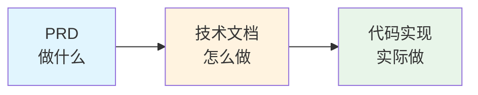
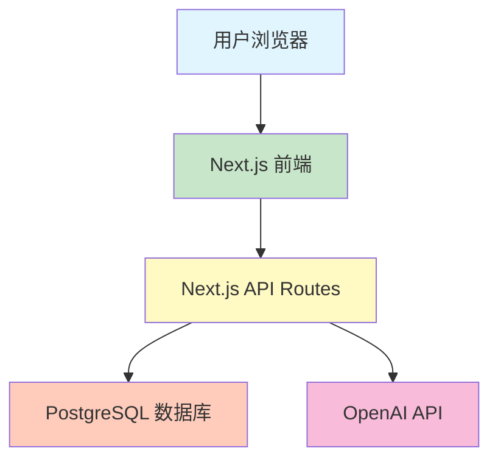

# 4.2 PRD 与技术文档的关系 🟢

> **阅读完本节后，你将会收获：**
> - 理解 PRD 与技术文档的明确分工
> - 掌握技术文档的核心组成部分
> - 学会将技术决策记录为文档
> - 理解文档在 AI 开发中的价值

> 在 PRD 迭代到 5 稿、产品方案基本确定后，除了梳理业务逻辑，还需要记录具体的技术实现方案，也就是技术文档。

---

## PRD 与技术文档的分工

很多人容易混淆 PRD 和技术文档，实际上它们的分工非常明确：PRD 回答"做什么"，技术文档回答"怎么做"。

### PRD（产品需求文档）

PRD 描述产品的业务逻辑和用户体验：

| 内容 | 说明 |
|------|------|
| 目标用户 | 谁会使用这个产品 |
| 核心功能 | 产品需要实现哪些功能 |
| 用户交互 | 用户如何完成操作 |
| 边缘场景 | 异常情况如何处理 |
| 业务流程 | 完整的用户操作流程 |

### 技术文档

技术文档描述产品的技术实现：

| 内容 | 说明 |
|------|------|
| 技术栈 | 使用哪些技术和框架 |
| 数据模型 | 数据库表结构如何设计 |
| API 设计 | 接口路径、参数、返回值 |
| 第三方集成 | 如何接入外部服务 |
| 部署方案 | 如何部署到生产环境 |

### 两者的关系



PRD 是技术文档的输入，技术文档是代码实现的蓝图。三者构成了从需求到实现的完整链条。

---

## 技术文档的核心组成部分

### 数据模型设计

数据模型描述数据库表的结构和关系。用简化的方式展示每个表的字段和类型。

以博客应用为例：

**用户表（users）**
| 字段 | 类型 | 说明 |
|------|------|------|
| id | UUID | 主键 |
| email | VARCHAR(255) | 邮箱（唯一） |
| password_hash | VARCHAR(255) | 密码哈希 |
| created_at | TIMESTAMP | 创建时间 |

**文章表（posts）**
| 字段 | 类型 | 说明 |
|------|------|------|
| id | UUID | 主键 |
| title | VARCHAR(255) | 标题 |
| content | TEXT | 内容 |
| author_id | UUID | 作者ID（外键） |
| created_at | TIMESTAMP | 创建时间 |

**评论表（comments）**
| 字段 | 类型 | 说明 |
|------|------|------|
| id | UUID | 主键 |
| content | TEXT | 评论内容 |
| post_id | UUID | 文章ID（外键） |
| user_id | UUID | 用户ID（外键） |
| created_at | TIMESTAMP | 创建时间 |

::: tip ORM Schema 就是文档

使用 Drizzle 或 Prisma 等 ORM 时，Schema 定义文件本身就是绝佳的数据模型文档。它能直观地展示表结构、字段类型和表之间的关系，AI 也能准确理解这些信息。

:::

### API 接口设计

API 设计定义每个接口的规范，包括路径、方法、参数和返回值。

以博客应用为例：

| 接口 | 方法 | 参数 | 返回值 |
|------|------|------|--------|
| /api/posts | GET | page, limit | 文章列表 |
| /api/posts/:id | GET | id | 单篇文章 |
| /api/posts | POST | title, content | 创建的文章 |
| /api/posts/:id | PATCH | id, title?, content? | 更新的文章 |
| /api/posts/:id | DELETE | id | 删除结果 |
| /api/posts/:id/comments | GET | id | 评论列表 |
| /api/posts/:id/comments | POST | id, content | 创建的评论 |

清晰的 API 设计是前后端协作的基础，也是 AI 生成接口代码的依据。

### 架构设计

架构设计描述整体技术选型和各组件的关系。



用架构图能让 AI 快速理解技术选型和组件关系。

### 第三方服务集成

记录如何接入外部 API，包括：

- 需要传递什么参数
- 如何处理认证
- 错误如何处理
- 限流和超时设置

这些信息让 AI 在编写代码时有明确的参考。

---

## 文档与代码同步

技术文档不是一成不变的。随着开发的深入，会不断调整和补充。

文档与代码的关系类似于地图与地形。当地形变化时，地图如果不更新，就会变成"过时地图"——看似有用，实际上会误导使用者。在软件开发中，这种误导的代价很高：新成员根据文档理解架构，却发现代码结构已经完全不同；AI 依据过时的 API 设计生成代码，导致集成失败；你自己在几个月后回顾项目，也被自己的文档搞得困惑。保持文档同步的诀窍不是"写完后不再改动"，而是"改动时顺便更新"。每次修改代码时，问自己：这个改动是否影响了文档中的描述？如果是，立即更新。这种习惯一旦养成，维护文档的成本会远低于处理文档不一致带来的问题。

1. **先写文档后写代码** — 文档是思考的过程，写代码前先想清楚
2. **变更即更新** — 代码改动后同步更新文档
3. **定期审查** — 定期检查文档是否与实际代码一致

文档与代码脱节的后果是：
- 新成员难以理解项目
- AI 依据过时文档生成错误代码
- 技术债务累积

---

## AI 时代的文档价值

在 AI 辅助开发中，文档的作用更加突出：

**对 AI 的价值**：
- 提供完整的上下文
- 减少猜测和误解
- 生成更准确的代码

**对开发者的价值**：
- 厘清思路
- 方便协作
- 降低认知负担

::: tip 文档是 AI 的上下文

AI 需要上下文才能准确工作。技术文档提供了结构化的上下文，让 AI 知道"用什么技术"、"数据结构是什么"、"接口怎么定义"。没有文档，AI 只能从代码中反推，效率更低。

:::

---

## 简化实践：项目文档

对于个人或小团队，不必拘泥于形式，可以将 PRD 和技术文档合并，统称为**项目文档**。但需要清楚区分哪些是产品层面的思考，哪些是技术层面的决策。

一种简单的组织方式：

```
/docs
  /prd
    - 01-需求背景.md
    - 02-功能列表.md
    - 03-用户故事.md
  /tech
    - 01-技术栈.md
    - 02-数据模型.md
    - 03-API设计.md
    - 04-部署方案.md
```

或者用单个文件按章节组织：

```markdown
# 项目文档

## 1. 产品部分
### 1.1 需求背景
### 1.2 核心功能
### 1.3 用户故事

## 2. 技术部分
### 2.1 技术栈
### 2.2 数据模型
### 2.3 API 设计
### 2.4 部署方案
```

选择哪种方式取决于项目规模和个人偏好。

---

## 常见问题

### Q1: 小项目需要写技术文档吗？

需要。小项目可以写得简单，但核心内容（数据模型、API 设计）应该记录。文档是给未来的自己和 AI 看的。

### Q2: 文档要写到多详细？

以"能让 AI 理解"为标准。数据模型要明确字段类型，API 要定义参数和返回值，架构要画出组件关系。

### Q3: 代码变了，文档忘了更新怎么办？

养成变更即更新的习惯。或者让 AI 帮忙：告诉它"我改了数据模型，帮我更新技术文档"。

### Q4: 可以让 AI 生成技术文档吗？

可以。在 PRD 确定后，让 AI 根据需求生成技术方案框架，然后人工审核和补充。

---

## 本节核心要点

- ✅ PRD 回答"做什么"，技术文档回答"怎么做"
- ✅ 技术文档包含：数据模型、API 设计、架构设计、第三方集成
- ✅ ORM Schema 文件本身就是数据模型文档
- ✅ 保持文档与代码同步，避免"过时地图"
- ✅ 文档是 AI 的重要上下文来源
- ✅ 小项目可以简化文档形式，但核心内容不能少

理解了文档的作用，接下来了解 API 和 HTTP 通信的基础知识。

---

## 相关内容

- 前置：[3.3 PRD 编写实战](../03-prd-doc-driven/03-prd-template-guide.md)
- 前置：[4.1 技术栈决策框架](./01-tech-stack-decision.md)
- 详见：[4.3 API与HTTP基础](./03-api-and-http.md)
