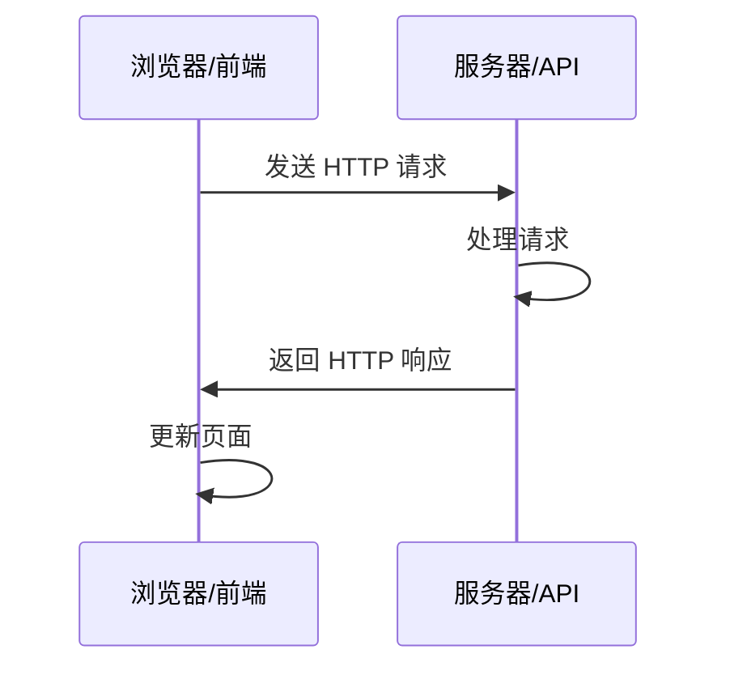
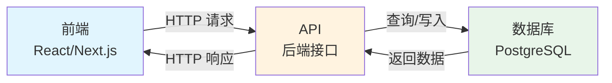

# 4.4 API 与 HTTP 基础 🟢

> **阅读完本节后，你将会收获：**
> - 理解 API 的概念和作用
> - 掌握 HTTP 协议的基本原理
> - 学会理解 HTTP 请求和响应的结构
> - 掌握常见 HTTP 状态码的含义
> - 了解前后端交互的基本流程

> HTTP 协议是前后端交互的"语言"，理解它的工作原理能让你更快定位问题。

---

## 引言

上一节你学会了读懂代码的基本逻辑。但一个完整的应用不只是本地代码——它需要与服务器通信，获取数据、提交操作。这种通信就是通过 **API** 和 **HTTP 协议** 实现的。

理解 HTTP 的工作原理，能让你在与 AI 协作时更准确地描述需求，也能在出问题时有能力排查。

---

## 什么是 API

**API（Application Programming Interface，应用程序接口）** 是不同软件之间通信的约定。

在 Web 开发中，API 通常指 **Web API** 或 **HTTP API**，即通过 HTTP 协议进行通信的接口。前端通过调用后端的 API 来获取数据或提交操作。

::: tip API 就像函数

还记得上一节讲的函数吗？API 本质上就是**远程的函数**。

- **函数**：定义在代码里，接收参数，返回结果
- **API**：定义在服务器上，接收 HTTP 请求（参数），返回 HTTP 响应（结果）

调用 API 就像调用函数：
- 函数调用：`calculatePrice(100, 2)` → 返回 `200`
- API 调用：`GET /api/price?unit=100&quantity=2` → 返回 `{ "total": 200 }`

两者的区别只在于：函数运行在本地，API 运行在远程服务器上。
:::

::: tip API 的餐厅类比

把 API 想象成餐厅的菜单：
- 前端是顾客
- 后端是厨房
- API 是菜单——告诉顾客可以点什么菜，每道菜叫什么名字
- HTTP 请求是服务员——把顾客的订单送到厨房，再把菜品端回来

:::

---

## HTTP 通信流程

HTTP 通信基于**请求-响应**模型。可以把 HTTP 请求想象成一个寄往远方的信封：信封上写着收件地址（URL），里面装着你想说的话（请求体），还有一些标签说明这封信的性质（Headers）。服务器收到信后，拆开阅读，写一封回信（响应），再寄回给你。

这个比喻有助于理解 HTTP 的本质：它是一种**文本协议**，所有信息都以人类可读的文本形式传递。当你打开浏览器开发者工具的 Network 面板，看到的那些请求记录，实际上就是这些"信封"的详细清单。



1. 前端发起 HTTP 请求
2. 服务器接收并处理请求
3. 服务器返回 HTTP 响应
4. 前端根据响应更新页面

---

## HTTP 请求的组成

一个完整的 HTTP 请求包含四个核心部分：

### 请求方法（Method）

告诉服务器你想做什么类型的事情：

| 方法 | 作用 | 示例 |
|------|------|------|
| **GET** | 读取数据 | 获取文章列表 |
| **POST** | 创建数据 | 提交注册表单 |
| **PUT/PATCH** | 修改数据 | 更新个人资料 |
| **DELETE** | 删除数据 | 删除一篇文章 |

### URL（路径）

指定要操作的资源地址：

```
https://api.example.com/users/123
│       │                │      │
│       │                │      └── 用户 ID
│       │                └── 资源路径
│       └── 域名
└── 协议
```

### Headers（头信息）

携带元数据，如身份认证、数据格式：

| 常见 Header | 说明 |
|------------|------|
| Authorization | 身份认证令牌 |
| Content-Type | 请求体的数据格式 |
| Accept | 期望响应的数据格式 |

### Body（主体）

实际发送的数据内容，通常使用 JSON 格式：

```json
{
  "title": "文章标题",
  "content": "文章内容"
}
```

---

## HTTP 响应的组成

HTTP 响应也包含多个部分：

### 状态码（Status Code）

三位数字，表示请求的处理结果。状态码的设计遵循一个简单规律：第一位数字表示响应的类别，后两位表示具体细节。这种设计让你即使看到陌生的状态码，也能根据第一位数字判断大致情况。

| 状态码 | 含义 | 常见场景 |
|--------|------|---------|
| **200 OK** | 成功 | 请求成功完成 |
| **201 Created** | 已创建 | POST 成功创建资源 |
| **204 No Content** | 无内容 | DELETE 成功删除 |
| **400 Bad Request** | 请求错误 | 参数格式错误 |
| **401 Unauthorized** | 未认证 | 缺少或无效的令牌 |
| **403 Forbidden** | 禁止访问 | 有令牌但权限不足 |
| **404 Not Found** | 未找到 | 资源不存在 |
| **429 Too Many Requests** | 请求过多 | 触发限流 |
| **500 Internal Server Error** | 服务器错误 | 服务器内部出错 |

::: tip 状态码速记

- **2xx**：成功了
- **4xx**：客户端的问题（你发送的请求有问题）
- **5xx**：服务器的问题（后端出错了）

:::

### Headers（响应头）

包含响应的元数据：

| 常见 Header | 说明 |
|------------|------|
| Content-Type | 响应体的数据格式 |
| Content-Length | 响应体的字节长度 |

### Body（响应体）

服务器返回的数据内容：

```json
{
  "id": "123",
  "title": "文章标题",
  "content": "文章内容",
  "createdAt": "2025-01-28T10:00:00Z"
}
```

---

## 完整示例：修改用户昵称

以下是一个完整的 HTTP 请求和响应示例：

**请求：**

```http
PATCH /api/users/123 HTTP/1.1
Host: api.example.com
Authorization: Bearer your_token_here
Content-Type: application/json

{
  "nickname": "新昵称"
}
```

**响应：**

```http
HTTP/1.1 200 OK
Content-Type: application/json

{
  "id": "123",
  "nickname": "新昵称",
  "updatedAt": "2025-01-28T10:00:00Z"
}
```

---

## 常见问题排查

理解 HTTP 的结构能帮助快速定位问题：

| 问题现象 | 可能原因 | 检查方法 |
|---------|---------|---------|
| 401 Unauthorized | 令牌无效或过期 | 检查 Authorization Header |
| 404 Not Found | URL 路径错误 | 检查请求路径是否正确 |
| 数据显示错误 | 字段名不匹配 | 检查响应数据格式与前端代码是否一致 |
| 429 Too Many Requests | 触发限流 | 减少请求频率或添加重试逻辑 |
| 网络错误 | 服务器无响应或网络不通 | 检查网络连接和服务器状态 |

### 数据格式不匹配

即使状态码是 200 OK，数据格式问题也会导致代码出错：

- 字段名不一致：后端返回 `userName`，前端用 `username`
- 类型不一致：后端返回字符串 `"123"`，前端期望数字 `123`
- 结构不一致：后端返回数组，前端期望对象

AI 知道如何处理格式转换和字段映射，遇到这类问题告诉它"数据格式对不上"即可。

理解 HTTP 协议的文本本质对调试很有帮助。当你在浏览器开发者工具中查看一个请求时，你看到的 Headers、Status Code、Response Body，这些都是 HTTP 协议的组成部分。它们以纯文本形式在网络中传输，只是被浏览器整理成了更易读的格式。如果你使用 curl 这样的命令行工具，你会看到这些信息的原始面貌——纯粹的文本行，每行以换行符分隔，Headers 和 Body 之间用一个空行隔开。这种透明性意味着你可以精确地看到前后端之间交换的每一比特信息，没有黑箱。

---

## JSON 数据格式

JSON（JavaScript Object Notation）是 Web API 最常用的数据格式。

**JSON 的特点**：
- 使用大括号 `{}` 表示对象
- 使用方括号 `[]` 表示数组
- 数据以"键: 值"的方式组织
- 键必须用双引号包裹

**示例**：

```json
{
  "users": [
    {
      "id": "1",
      "name": "张三",
      "email": "zhang@example.com"
    },
    {
      "id": "2",
      "name": "李四",
      "email": "li@example.com"
    }
  ],
  "total": 2,
  "page": 1
}
```

::: tip JSON 是通用语言

JSON 是不同编程语言之间的"普通话"。Python、JavaScript、Java、Go 等语言都能轻松解析和生成 JSON，这使得它成为 Web API 的标准数据格式。

:::

---

## 前后端交互示意



---

## 常见问题

### Q1: 需要记住所有 HTTP 状态码吗？

不需要。记住最常见的几个（200、401、404、500）就够用了，其他的可以查。

### Q2: GET 和 POST 的区别是什么？

GET 用于读取数据，参数通常放在 URL 中；POST 用于创建数据，参数放在 Body 中。GET 可以被缓存，POST 不行。

### Q3: 如何测试 API？

可以用以下工具：
- 浏览器开发者工具（Network 面板）
- Postman 或 Insomnia 等 API 测试工具
- 命令行工具 curl
- 让 AI 写测试代码

### Q4: HTTPS 和 HTTP 的区别是什么？

HTTPS 是加密的 HTTP，数据在传输过程中被加密，更安全。现代网站都应该使用 HTTPS。

---

## 本节核心要点

- ✅ API 是前后端通信的接口
- ✅ HTTP 基于"请求-响应"模型
- ✅ HTTP 请求包含：方法、URL、Headers、Body
- ✅ HTTP 响应包含：状态码、Headers、Body
- ✅ 2xx 成功、4xx 客户端错误、5xx 服务器错误
- ✅ JSON 是 Web API 的标准数据格式
- ✅ 理解 HTTP 结构能快速定位问题

理解了 HTTP 通信的基础知识后，接下来了解前后端分离的概念。

---

## 相关内容

- 前置：[1.3 浏览器与服务器基础](../01-environment-setup/03-browser-server.md)
- 前置：[4.3 如何读懂 AI 生成的代码](./03-programming-basics.md)
- 详见：[4.5 前后端分离概念](./05-frontend-backend-separation.md)
