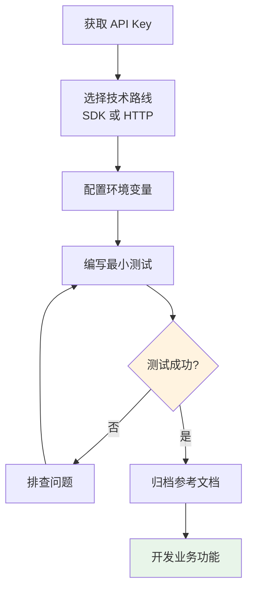

# 4.5 API 集成实战 🟢

> **阅读完本节后，你将会收获：**
> - 掌握 API 集成的完整流程
> - 理解 SDK 与直接 HTTP 请求的区别
> - 学会安全地管理 API 密钥
> - 掌握常见错误处理方法
> - 了解限流和超时的处理策略

> 集成外部 API 是扩展应用能力的常见方式，如接入 AI 能力、地图服务等。

---

## API 集成概述

外部 API 让你的应用能够使用其他服务的能力：

| 能力 | 常见 API |
|------|---------|
| AI 对话 | OpenAI API、Anthropic API |
| 地图服务 | Google Maps、高德地图 |
| 支付能力 | Stripe、支付宝 |
| 数据存储 | Cloudflare R2、AWS S3 |
| 邮件发送 | Resend、SendGrid |

大多数外部 API 都提供：
- **免费额度**：足够测试和小规模使用
- **开发者文档**：详细的接口说明和示例
- **SDK**：官方封装的调用库

---

## API 集成六步法

### 第一步：获取凭证

1. 找到官方开放平台或开发者文档
2. 注册开发者账号
3. 创建应用或项目
4. 生成 **API Key**（这是你的身份凭证）

::: warning 安全第一

API Key 是敏感信息，切勿泄露。不要将其：
- 提交到 Git 仓库
- 写在前端代码中
- 发布在公开场合

:::

### 第二步：技术路线选择

集成 API 有两种方式：**SDK** 和 **直接 HTTP 请求**。

| 方式 | 优点 | 缺点 | 适用场景 |
|------|------|------|---------|
| **SDK** | 官方封装、类型完善、文档齐全 | 需要安装依赖 | 大多数情况 |
| **HTTP 请求** | 无依赖、轻量 | 需要手写协议处理 | 简单调用或无 SDK |

::: tip 优先使用 SDK

官方 SDK 通常自带完善的 TypeScript 类型定义。这相当于给 AI 提供了代码指南，它能准确知道有哪些功能、参数怎么填，比让 AI 对着 HTTP 文档"瞎编"靠谱得多。

:::

SDK（Software Development Kit，软件开发工具包）的本质是官方提供的"翻译器"。当你使用 SDK 时，你使用的是该编程语言习惯的函数调用方式，而 SDK 内部负责将这些调用转换为标准的 HTTP 请求。这种封装隐藏了协议细节：你不需要手动设置请求头、序列化 JSON、处理响应状态码——SDK 帮你完成这一切。更重要的是，官方 SDK 通常经过充分测试，能正确处理各种边缘情况，如网络超时、错误重试、认证刷新等。对于 AI 辅助开发来说，SDK 还有一个隐性优势：它的 API 设计往往遵循该语言的惯用模式，这让 AI 更容易生成符合最佳实践的代码。

对于 AI 应用，推荐使用 **Vercel AI SDK**：
- 极大简化了 AI 应用的开发
- 处理了复杂的流式传输协议
- 让 AI 的回复能够实时逐字显示

### 第三步：配置环境变量

将 API Key 存储在环境变量文件中，而不是代码里：

```bash
# .env 文件
OPENAI_API_KEY=sk-xxx
ANTHROPIC_API_KEY=sk-ant-xxx
```

环境变量就像是代码和密钥之间的"防火墙"：
- 程序运行时自动读取配置
- `.env` 文件不提交到 Git
- 不同环境使用不同密钥

::: tip .env 文件

Next.js 项目中，`.env.local` 文件用于存储本地开发的环境变量。部署到生产环境时，在部署平台的设置中配置相同的环境变量即可。

:::

### 第四步：编写最小测试

配置好 SDK 和 API Key 后，**不要急着写业务功能**，先写一个最简单的测试：

```typescript
// 测试 API 连接
import OpenAI from 'openai';

const openai = new OpenAI();

async function testConnection() {
  const response = await openai.chat.completions.create({
    model: 'gpt-4o-mini',
    messages: [{ role: 'user', content: 'Hello' }],
    max_tokens: 10,
  });

  console.log(response.choices[0].message.content);
}

testConnection();
```

如果测试成功，说明：
- API Key 有效
- 网络连接正常
- SDK 配置正确

如果测试失败，AI 会根据错误信息帮你排查：
- Key 填错了？
- 网络不通？
- SDK 版本冲突？
- 额度用完了？

### 第五步：归档参考文档

将 API 的关键信息整理归档，方便后续使用：

```markdown
# API 参考

## OpenAI Chat Completions

- 接口：POST https://api.openai.com/v1/chat/completions
- 文档：https://platform.openai.com/docs/api-reference/chat

### 请求参数
- model: 模型名称（如 gpt-4o-mini）
- messages: 对话消息数组
- max_tokens: 最大生成 token 数

### 示例
\`\`\`typescript
const response = await openai.chat.completions.create({
  model: 'gpt-4o-mini',
  messages: [{ role: 'user', content: '你好' }],
});
\`\`\`
```

这样下次让 AI 写相关功能时，直接把文档喂给它，它就能精准地写出调用代码。

### 第六步：业务功能开发

基础打好后，就可以在业务中使用 API 了。

告诉 AI 你想实现什么功能，它会根据 API 文档写出调用代码。

::: tip 避免频繁调用

不要在循环中频繁调用 API：
- 既消耗 API 额度
- 又容易触发限流
- 响应速度慢

合理使用缓存，相同的数据可以存起来重复使用。

:::

---

## 常见错误处理

### 限流（Rate Limit）

大多数 API 都有调用频率限制，超过会返回 `429 Too Many Requests`。

**处理方法**：
- 添加重试逻辑（等一会儿再试）
- 使用队列控制请求频率
- 分析是否可以优化调用逻辑

### 超时处理

API 如果迟迟不响应，程序会卡住。

**处理方法**：
- 设置超时时间
- 添加超时后的降级逻辑
- 显示友好的错误提示

### 认证失败

API Key 过期或无效会返回 `401 Unauthorized`。

**处理方法**：
- 检查 API Key 是否正确
- 确认 Key 没有过期
- 检查是否有足够的调用额度

---

## API 集成流程图



---

## 安全最佳实践

| 实践 | 说明 |
|------|------|
| 使用环境变量 | API Key 不写入代码 |
| .gitignore 排除 | 确保 .env 文件不被提交 |
| 后端代理 | 敏感 API 调用通过后端进行 |
| 最小权限原则 | 只给 API 必要的权限 |
| 定期轮换 | 定期更换 API Key |

::: tip 前端不能直接调用敏感 API

不要在前端代码中直接调用需要 API Key 的接口。API Key 会被所有人看到，可能被滥用。

正确做法：后端接收前端请求，后端使用 API Key 调用外部 API，然后将结果返回给前端。

:::

---

## 常见问题

### Q1: 免费 API 额度用完了怎么办？

大多数 API 提供商都有付费计划。评估项目用量，选择合适的套餐。如果只是学习，可以申请教育或开发者优惠。

### Q2: 如何测试 API 而不消耗额度？

使用 Mock 数据或测试环境。很多 API 提供商提供测试模式，返回假数据但不计费。

### Q3: SDK 版本冲突怎么办？

使用 AI 帮忙解决。告诉它具体的错误信息和依赖版本，它会给出兼容的版本组合或替代方案。

### Q4: 多个环境（开发/生产）如何管理 API Key？

使用不同的环境变量文件。Next.js 支持 `.env.local`（本地）、`.env.production`（生产）等多环境配置。

---

## 本节核心要点

- ✅ API 集成遵循六步法：获取凭证 → 选择路线 → 配置变量 → 测试 → 归档 → 开发
- ✅ 优先使用官方 SDK，类型定义让 AI 更准确
- ✅ API Key 必须存储在环境变量中
- ✅ 先写最小测试，验证通过后再开发业务功能
- ✅ 注意限流、超时、认证失败等常见错误
- ✅ 敏感 API 必须通过后端调用，不能暴露在前端

理解了 API 集成后，接下来了解配置文件格式。

---

## 相关内容

- 前置：[4.3 API与HTTP基础](./03-api-and-http.md)
- 前置：[4.4 前后端分离概念](./04-frontend-backend-separation.md)
- 详见：[4.6 配置文件格式](./06-config-formats.md)
