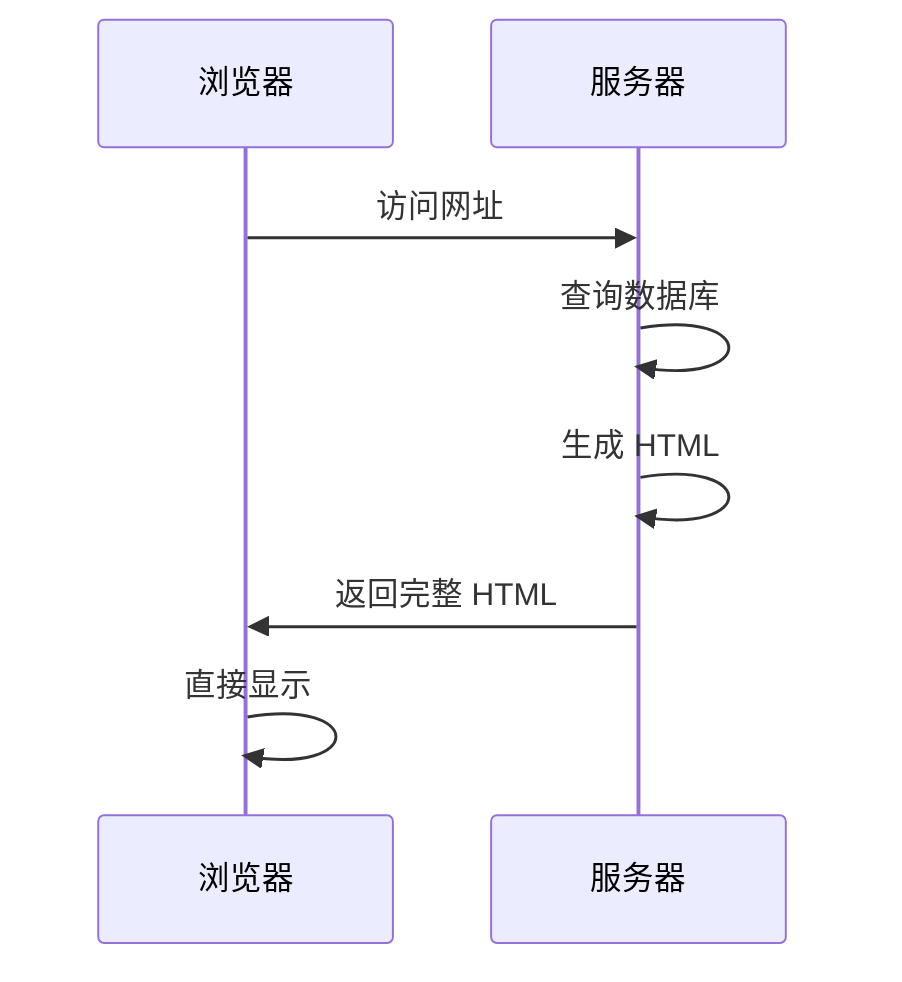
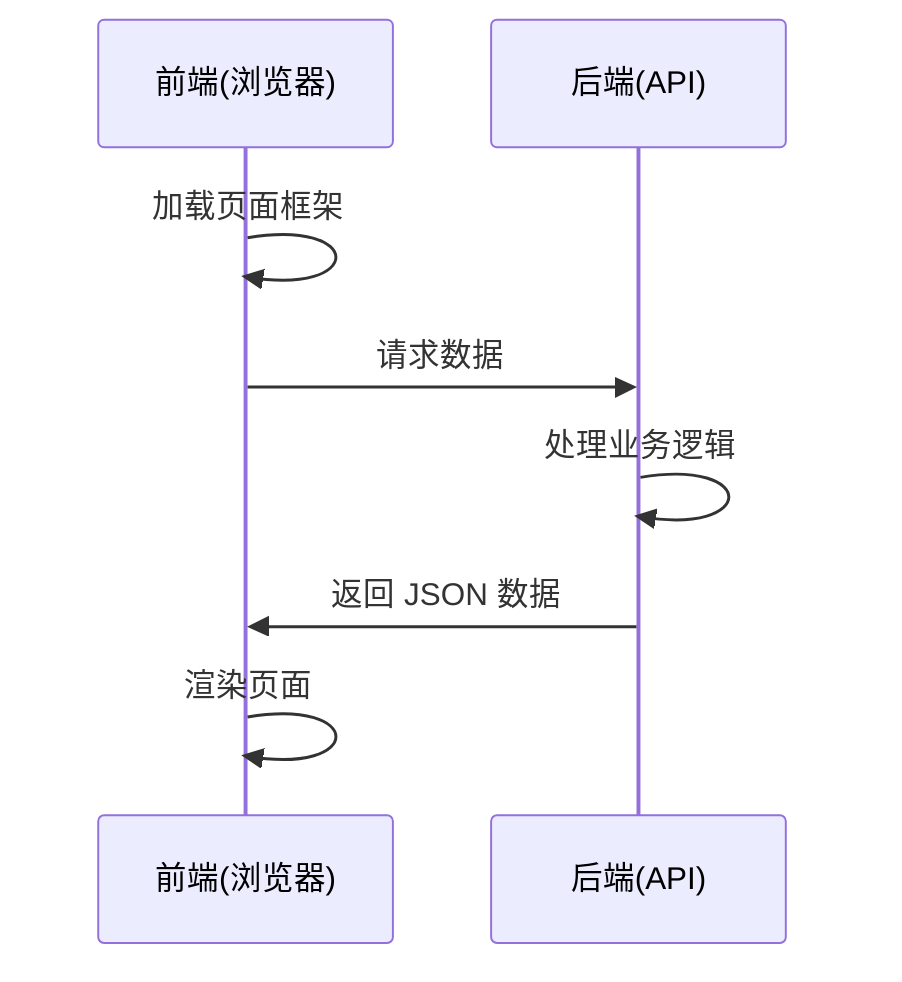
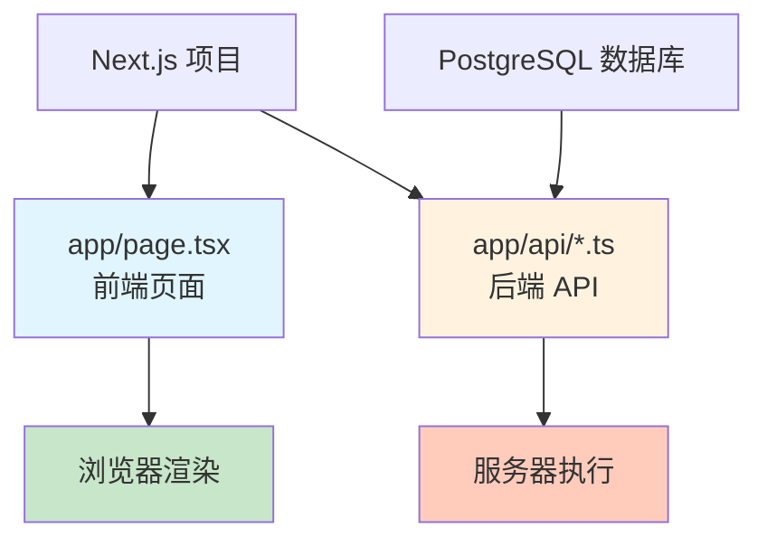
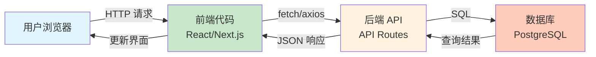

# 4.5 前后端分离概念 🟢

> **阅读完本节后，你将会收获：**
> - 理解前端和后端的职责分工
> - 掌握前后端分离的架构模式
> - 了解全栈框架如何简化开发
> - 理解模块化思维的重要性

> 前端负责"展示"，后端负责"处理"，两者通过 API 通信。

---

## 前端和后端的职责

### 前端（Frontend）

前端运行在用户浏览器中，负责用户看到和操作的一切：

| 职责 | 说明 |
|------|------|
| 页面渲染 | 将 HTML、CSS 转换为可视化界面 |
| 用户交互 | 响应点击、输入等用户操作 |
| 数据展示 | 将后端返回的数据展示给用户 |
| 数据收集 | 收集用户输入并发送给后端 |

### 后端（Backend）

后端运行在服务器上，负责用户看不见的业务逻辑：

| 职责 | 说明 |
|------|------|
| 业务逻辑 | 处理核心业务规则 |
| 数据存储 | 与数据库交互，存储和查询数据 |
| 身份认证 | 验证用户身份和权限 |
| 外部服务 | 调用第三方 API |

前后端的这种分工有其历史渊源。早期的 Web 开发中，服务器直接生成完整的 HTML 页面发送给浏览器，浏览器只负责展示。随着 JavaScript 能力的增强和 AJAX 技术的出现，浏览器开始承担更多的渲染工作，后端则专注于提供数据。这种演变让 Web 应用从"页面"转变为"应用"——用户体验更接近原生软件，交互更流畅，功能更强大。理解这个演变过程有助于你把握前后端分离的本质：它不是某种特定的技术选择，而是一种让各自专注于自己擅长领域的架构思想。

---

## 传统模式 vs 前后端分离

### 传统模式（服务端渲染）

在 Web 早期，页面由服务器直接生成完整的 HTML 发送给浏览器：



这种模式的特点：
- 服务器生成完整 HTML
- 浏览器只负责展示
- 页面切换需要重新加载
- 前后端代码耦合在一起

### 前后端分离模式

现代 Web 应用采用前后端分离架构：



这种模式的特点：
- 前端负责页面渲染
- 后端只提供数据 API
- 通信使用 JSON 格式
- 前后端可以独立开发和部署

---

## 前后端分离的优势

| 优势 | 说明 |
|------|------|
| **职责清晰** | 前端专注展示，后端专注逻辑 |
| **独立开发** | 前后端可以并行开发，互不阻塞 |
| **技术解耦** | 前后端可以使用不同的技术栈 |
| **复用性强** | 同一套 API 可以服务 Web、App 等多种客户端 |
| **体验更好** | 页面切换不需要重新加载，交互更流畅 |

---

## 全栈框架的兴起

随着 JavaScript 生态的发展，出现了**全栈框架**，如 Next.js。这类框架让前端和后端代码都在同一个项目中，用同一种语言（TypeScript）编写，但职责分工没有变化：



全栈框架的优势：
- **统一语言**：前后端都用 TypeScript
- **类型共享**：前后端可以共享类型定义
- **简化部署**：一个项目同时包含前后端
- **开发效率**：减少上下文切换

::: tip Next.js 的全栈能力

Next.js 的 API Routes 让你在同一个项目中编写后端代码。这些代码在服务器端执行，可以安全地访问数据库和调用外部 API，而前端代码在浏览器中执行，负责展示和交互。

:::

---

## 模块化思维

无论是否使用全栈框架，都应该保持模块化思维：把功能拆分成不同的模块，而不是把所有代码塞在一个文件里。

模块化思维的价值在于降低认知复杂度。当一个项目只有几百行代码时，所有内容放在一个文件中似乎并无不妥。但随着功能增加，代码量可能迅速增长到数千甚至数万行。如果没有清晰的模块划分，理解和维护代码将变得极其困难——你需要在大量无关代码中寻找目标，修改时担心影响其他部分。模块化的本质是一种"分而治之"的策略：将大问题分解为小问题，每个小问题由独立的模块解决，模块之间通过清晰的接口交互。这不仅让代码更易理解，也让 AI 能更准确地定位和处理特定功能。

### 典型的模块划分

```
src/
├── app/              # Next.js App Router
│   ├── page.tsx      # 前端页面
│   └── api/          # API 路由
│       ├── auth/     # 认证相关
│       ├── posts/    # 文章相关
│       └── users/    # 用户相关
├── components/       # 可复用组件
├── lib/             # 工具函数
└── db/              # 数据库相关
```

### 模块化的好处

| 好处 | 说明 |
|------|------|
| 易于维护 | 每个模块职责单一，修改影响范围小 |
| 易于理解 | 清晰的目录结构让项目更易读 |
| 易于测试 | 小模块更容易编写单元测试 |
| 团队协作 | 不同人可以开发不同模块 |
| AI 友好 | AI 能更快定位相关代码 |

---

## 前后端通信示意



---

## 客户端与服务器端

理解代码在哪里执行是写好全栈应用的关键：

| 代码位置 | 执行环境 | 能访问什么 |
|---------|---------|-----------|
| **客户端代码** | 浏览器 | 页面 DOM、用户设备（有限）、Cookie |
| **服务器端代码** | 服务器 | 文件系统、数据库、所有网络请求、环境变量 |

**客户端（Client-side）**：用户的浏览器。前端代码在这里运行，负责展示界面和处理用户交互。但客户端无法直接访问数据库或敏感信息。

**服务器端（Server-side）**：远程服务器。后端代码在这里运行，可以安全地访问数据库、调用外部 API、处理敏感信息。用户看不到服务器端的代码。

这种分离是 Web 安全的基础——你不能把数据库密码放在客户端代码中，因为任何人都可以查看浏览器的源代码。

---

## 模板渲染的概念

在传统的服务端渲染（如 Flask、Django）中，**模板引擎**是一种在服务器端生成 HTML 的技术：

```
服务器端：模板 + 数据 → 渲染 → 完整 HTML → 发送给浏览器
```

模板通常包含：
- 静态 HTML 结构
- 占位符（如 `{{ username }}`）用于插入动态数据
- 简单的逻辑（如循环、条件判断）

**React 与模板的对比**：
- **传统模板**（如 Jinja2）：在服务器端渲染，生成完整 HTML 后发送给浏览器
- **React 组件**：在客户端（或服务器端）渲染，通过 JavaScript 动态更新界面

Next.js 结合了两种模式：
- **服务端组件**：类似传统模板，在服务器渲染，可以访问数据库
- **客户端组件**：类似 React 应用，在浏览器运行，负责交互

---

## 代码位置的判断

写代码时要清楚代码在哪里执行：

| 代码位置 | 执行环境 | 能访问什么 |
|---------|---------|-----------|
| **前端代码** | 浏览器 | 页面 DOM、用户设备（有限） |
| **后端代码** | 服务器 | 文件系统、数据库、所有网络请求 |
| **API 路由** | 服务器 | 服务器资源、数据库 |
| **服务端组件** | 服务器 | 数据库、文件系统 |

::: tip Next.js 特殊性

Next.js 的服务端组件（Server Components）在服务器渲染，可以安全地访问数据库。客户端组件（Client Components）在浏览器运行，只能通过 API 与后端通信。

:::

---

## 常见问题

### Q1: 全栈框架和前后端分离矛盾吗？

不矛盾。全栈框架是开发方式，前后端分离是架构模式。全栈框架让前后端代码在同一个项目中，但它们的职责仍然是分离的。

### Q2: 什么时候需要前后端分离？

团队有多人协作、需要支持多种客户端（Web + App）、前后端技术栈差异大时，前后端分离更有价值。个人项目用全栈框架更高效。

### Q3: 模块拆分要多细？

以"单一职责"为原则。一个模块负责一个功能领域，如 `auth` 模块只负责认证，`posts` 模块只负责文章。避免过细（每个文件只有几行）或过粗（一个文件包含所有功能）。

### Q4: 如何判断代码应该写在前端还是后端？

需要访问数据库、调用外部 API、处理敏感信息的代码必须在后端。纯 UI 渲染、用户交互的代码在前端。拿不准时优先放在后端，更安全。

---

## 本节核心要点

- ✅ 前端负责展示，后端负责处理
- ✅ 前后端分离提高了开发效率和代码复用性
- ✅ 全栈框架让前后端用同一种语言，但职责不变
- ✅ 模块化思维是项目长期维护的关键
- ✅ 清楚代码执行位置是写好全栈应用的前提

理解了前后端分离后，接下来学习如何集成外部 API。

---

## 相关内容

- 前置：[1.3 浏览器与服务器基础](../01-environment-setup/03-browser-server.md)
- 前置：[4.4 API与HTTP基础](./04-api-and-http.md)
- 详见：[4.6 配置文件格式](./06-config-formats.md)
