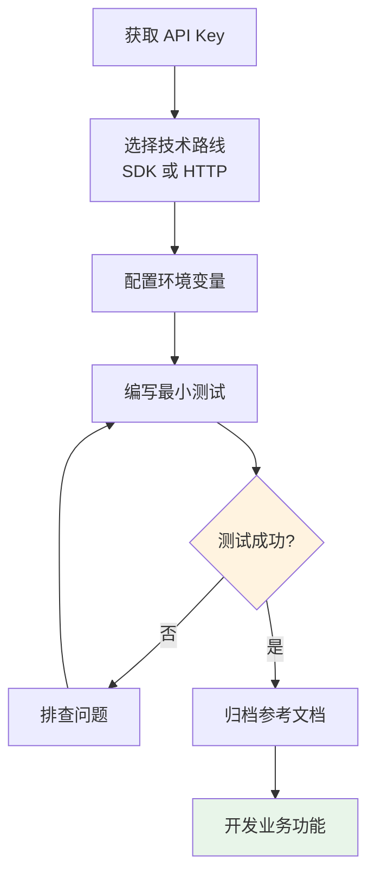

# 4.7 API 集成实战 🟢

> **阅读完本节后，你将会收获：**
> - 掌握 API 集成的完整流程
> - 理解 SDK 与直接 HTTP 请求的区别
> - 学会安全地管理 API 密钥
> - 掌握常见错误处理方法
> - 了解限流和超时的处理策略

> 集成外部 API 是扩展应用能力的常见方式，如接入 AI 能力、地图服务等。

---

## API 集成概述

现代软件开发的一个美妙之处在于：你不需要从零开始构建一切。无论你想做什么——让 AI 对话、显示地图、处理支付——都有现成的服务愿意为你做这些脏活累活。你只需要通过 **API** 与它们对话。

API（Application Programming Interface，应用程序接口）就是应用程序之间交流的语言。以前，两个软件要"对话"需要复杂的协议和专门的对接开发。现在，大多数服务都提供了标准化的 API，你只需要按照它们约定的格式发送请求，就能得到想要的结果。

### 为什么 API 如此重要？

想象一下，你想做一个旅游应用。你需要在地图上标注景点，显示当地天气，处理用户支付。在 API 出现之前，你必须自己搭建地图服务器、雇佣气象学家、对接银行系统。现在呢？调用地图 API、调用天气 API、调用支付 API——你只需要关注自己的核心业务逻辑，剩下的都交给专业人士去做。

这不仅是效率问题，更是可能性问题。API 让个人开发者也能做出以前只有大公司才能做出的产品。你可以把不同服务的数据和能力像搭积木一样组合起来，创造出全新的东西。

### 异步通信与数据格式

现代 Web 应用使用 **AJAX**（Asynchronous JavaScript and XML）技术与服务器交换数据。用户操作后，JavaScript 在后台发送请求，服务器返回数据，页面局部更新而无需刷新。这种异步方式让交互更流畅。

API 通常返回 **JSON** 格式的数据（参见 4.6 配置文件格式）。JSON 是纯数据结构，任何编程语言都能解析，前端可以灵活地将其渲染成任意样式。

### 常见的 API 能力

| 能力 | 常见 API | 你能做什么 |
|------|---------|-----------|
| **AI 对话** | OpenAI、Anthropic | 聊天机器人、内容生成 |
| **地图服务** | Google Maps、高德地图 | 位置标注、路线规划 |
| **支付能力** | Stripe、支付宝 | 在线收款、订阅管理 |
| **数据存储** | Cloudflare R2、AWS S3 | 文件上传、数据备份 |
| **邮件发送** | Resend、SendGrid | 通知邮件、营销邮件 |
| **短信/语音** | Twilio | 验证码、语音通知 |

大多数 API 都很友好：
- 提供**免费额度**让你测试和小规模使用
- 有详细的**开发者文档**和示例代码
- 提供**官方 SDK**帮你快速集成

---

## API 集成六步法

### 第一步：获取凭证

就像你需要身份证才能入住酒店一样，使用 API 也需要证明你的身份。这个身份证明就是 **API Key**。

获取 API Key 的过程通常很简单：
1. 找到官方开放平台或开发者文档
2. 注册开发者账号
3. 创建应用或项目（填写一些基本信息）
4. 生成 API Key

::: warning 安全第一

API Key 就像你的银行卡密码——一旦泄露，别人就能冒充你使用服务，甚至花光你的额度。所以：
- **不要**提交到 Git 仓库
- **不要**写在前端代码中（用户能看到）
- **不要**发布在公开场合

:::

### 第二步：选择技术路线

拿到 API Key 后，你需要决定如何调用 API。有两种方式：**SDK** 和 **直接 HTTP 请求**。

| 方式 | 优点 | 缺点 | 适用场景 |
|------|------|------|---------|
| **SDK** | 官方封装、类型完善、文档齐全 | 需要安装依赖 | 大多数情况 |
| **HTTP 请求** | 无依赖、轻量 | 需要手写协议处理 | 简单调用或无 SDK |

**什么是 SDK？**

SDK（Software Development Kit，软件开发工具包）是官方提供的"翻译器"。想象一下：API 说的是英语，而你的代码说的是中文。SDK 就是那个帮你实时翻译的助手。

当你使用 SDK 时，你用的是熟悉的编程语言写函数调用，SDK 内部帮你处理 HTTP 请求、JSON 序列化、错误处理等细节。更重要的是，官方 SDK 通常经过充分测试，能正确处理超时、重试、认证刷新等边缘情况。

::: tip 为什么优先使用 SDK？

官方 SDK 自带完善的 TypeScript 类型定义。这相当于给 AI 提供了一份详细的"代码地图"——它能准确知道有哪些功能、参数怎么填、返回值是什么。这比让 AI 对着空白的 HTTP 文档"瞎猜"靠谱得多。

:::

对于 AI 应用，推荐使用 **Vercel AI SDK**：
- 极大简化了 AI 应用的开发
- 处理了复杂的流式传输协议
- 让 AI 的回复能够实时逐字显示

### 第三步：配置环境变量

你拿到了 API Key，现在需要把它安全地存放在代码中。直接把 Key 写在代码里是大忌——任何能看到代码的人都能拿走它。

正确的做法是使用**环境变量**：

```bash
# .env 文件
OPENAI_API_KEY=sk-xxx
ANTHROPIC_API_KEY=sk-ant-xxx
```

环境变量就像是代码和密钥之间的"防火墙"：
- 程序运行时自动读取配置
- `.env` 文件不提交到 Git
- 不同环境使用不同密钥

::: tip .env 文件

Next.js 项目中，`.env.local` 文件用于存储本地开发的环境变量。部署到生产环境时，在部署平台的设置中配置相同的环境变量即可。

:::

### 第四步：编写最小测试

配置好 SDK 和 API Key 后，你可能会迫不及待地想开始写业务功能。但等等——先写一个最简单的测试。

为什么？因为如果你直接写复杂功能，一旦出问题，你不知道是配置错了、Key 无效了、还是代码逻辑有问题。而一个最简单的测试，只需要验证一件事：**我能连上 API 吗？**

这个测试代码只需要做一件事：调用一次 API，看能否收到返回结果。如果成功了，说明你的配置是正确的，可以继续开发。如果失败了，AI 能根据错误信息帮你快速定位问题。

配置好 SDK 和 API Key 后，**不要急着写业务功能**，先写一个最简单的测试：

```typescript
// 测试 API 连接
import OpenAI from 'openai';

const openai = new OpenAI();

async function testConnection() {
  const response = await openai.chat.completions.create({
    model: 'gpt-4o-mini',
    messages: [{ role: 'user', content: 'Hello' }],
    max_tokens: 10,
  });

  console.log(response.choices[0].message.content);
}

testConnection();
```

如果测试成功，说明：
- API Key 有效
- 网络连接正常
- SDK 配置正确

如果测试失败，AI 会根据错误信息帮你排查：
- Key 填错了？
- 网络不通？
- SDK 版本冲突？
- 额度用完了？

### 第五步：归档参考文档

等测试通过了，不要急着继续开发。先把 API 的关键信息整理一下，存到文档里。

为什么？因为下次你让 AI 写相关功能时，如果直接把文档喂给它，它就能精准地写出调用代码。否则你可能需要反复解释各种参数和细节。

归档的内容不需要太复杂，记录这些就够了：

```markdown
# API 参考

## OpenAI Chat Completions

- 接口：POST https://api.openai.com/v1/chat/completions
- 文档：https://platform.openai.com/docs/api-reference/chat

### 请求参数
- model: 模型名称（如 gpt-4o-mini）
- messages: 对话消息数组
- max_tokens: 最大生成 token 数

### 示例
\`\`\`typescript
const response = await openai.chat.completions.create({
  model: 'gpt-4o-mini',
  messages: [{ role: 'user', content: '你好' }],
});
\`\`\`
```

### 第六步：业务功能开发

基础打好了，现在可以开始写业务功能了。告诉 AI 你想实现什么功能，把刚才归档的 API 文档一起提供给它，它就能写出准确的调用代码。

::: tip 避免频繁调用

不要在循环中频繁调用 API：
- 既消耗 API 额度
- 又容易触发限流
- 响应速度慢

合理使用缓存，相同的数据可以存起来重复使用。

:::

---

## 常见错误处理

### 限流（Rate Limit）

大多数 API 都有调用频率限制，超过会返回 `429 Too Many Requests`。

**处理方法**：
- 添加重试逻辑（等一会儿再试）
- 使用队列控制请求频率
- 分析是否可以优化调用逻辑

### 超时处理

API 如果迟迟不响应，程序会卡住。

**处理方法**：
- 设置超时时间
- 添加超时后的降级逻辑
- 显示友好的错误提示

### 认证失败

API Key 过期或无效会返回 `401 Unauthorized`。

**处理方法**：
- 检查 API Key 是否正确
- 确认 Key 没有过期
- 检查是否有足够的调用额度

---

## API 集成流程图



---

## 安全最佳实践

| 实践 | 说明 |
|------|------|
| 使用环境变量 | API Key 不写入代码 |
| .gitignore 排除 | 确保 .env 文件不被提交 |
| 后端代理 | 敏感 API 调用通过后端进行 |
| 最小权限原则 | 只给 API 必要的权限 |
| 定期轮换 | 定期更换 API Key |

::: tip 前端不能直接调用敏感 API

不要在前端代码中直接调用需要 API Key 的接口。API Key 会被所有人看到，可能被滥用。

正确做法：后端接收前端请求，后端使用 API Key 调用外部 API，然后将结果返回给前端。

:::

---

## API 依赖的风险

使用外部 API 确实很方便，但有一个重要的风险你需要知道：**不要过度依赖单一 API**。

**服务可能关闭或涨价。** 提供 API 的公司可能随时停止服务、改变定价策略，或者大幅降低免费额度。如果你的业务完全建立在某个 API 之上，一旦这个 API 没了，你的应用也可能跟着瘫痪。

**API 可能发生变化。** 即使服务还在，API 本身的接口也可能变化。今天返回的是 `user_name`，明天可能变成 `userName`。这种看似微小的变化就可能导致你的应用崩溃。

**应对策略：**
- **保留备选方案**：如果可能，了解有哪些类似的 API 可用
- **抽象封装**：把 API 调用封装成自己的函数，这样即使换 API，修改一处即可
- **缓存重要数据**：不要每次都去请求 API，把结果存起来，减少依赖
- **监控 API 健康度**：定期检查 API 是否正常响应

---

## 常见问题

### Q1: 免费 API 额度用完了怎么办？

大多数 API 提供商都有付费计划。评估项目用量，选择合适的套餐。如果只是学习，可以申请教育或开发者优惠。

### Q2: 如何测试 API 而不消耗额度？

使用 Mock 数据或测试环境。很多 API 提供商提供测试模式，返回假数据但不计费。

### Q3: SDK 版本冲突怎么办？

使用 AI 帮忙解决。告诉它具体的错误信息和依赖版本，它会给出兼容的版本组合或替代方案。

### Q4: 多个环境（开发/生产）如何管理 API Key？

使用不同的环境变量文件。Next.js 支持 `.env.local`（本地）、`.env.production`（生产）等多环境配置。

---

## 本节核心要点

- ✅ API 集成遵循六步法：获取凭证 → 选择路线 → 配置变量 → 测试 → 归档 → 开发
- ✅ 优先使用官方 SDK，类型定义让 AI 更准确
- ✅ API Key 必须存储在环境变量中
- ✅ 先写最小测试，验证通过后再开发业务功能
- ✅ 注意限流、超时、认证失败等常见错误
- ✅ 敏感 API 必须通过后端调用，不能暴露在前端

理解了 API 集成后，接下来学习如何编写项目说明书。

---

## 相关内容

- 前置：[4.4 API与HTTP基础](./04-api-and-http.md)
- 前置：[4.5 前后端分离概念](./05-frontend-backend-separation.md)
- 前置：[4.6 配置文件格式](./06-config-formats.md)
- 详见：[4.8 项目说明书结构](./08-readme-structure.md)
