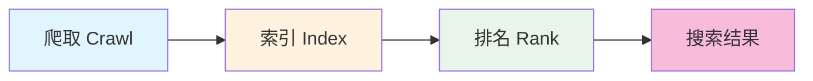

# 15.2 SEO 全攻略 🔴

> **阅读完本节后，你将会收获：**
> - 理解 SEO 的基本原理和搜索引擎工作方式
> - 掌握 Metadata、Sitemap、Robots.txt 的配置
> - 学会内容优化和技术 SEO 的核心方法
> - 了解页面速度和 Core Web Vitals 优化
> - 掌握加速索引和针对不同平台的优化策略

> 搜索引擎的爬虫是"瞎子"，需要给它指路。SEO 配置和优化就是为爬虫提供清晰的路标。

---

## 什么是 SEO

**SEO（Search Engine Optimization，搜索引擎优化）** 是让网站在搜索结果中获得更好排名的方法。

搜索引擎使用爬虫（Crawler）来发现和索引网页。爬虫沿着链接从一个页面跳到另一个页面，收集信息并建立索引。

### SEO 的价值

| 价值 | 说明 |
|------|------|
| **免费流量** | 不需要付费广告就能获得访问 |
| **持续收益** | 好的 SEO 效果可以长期维持 |
| **精准用户** | 搜索用户有明确需求 |
| **品牌曝光** | 排名靠前提升品牌可信度 |

::: tip SEO 是长期投资

SEO 不会一夜之间让你排到第一，但长期坚持会让你的网站在搜索结果中逐渐上升。

:::

---

## 搜索引擎的工作原理

搜索引擎通过三个步骤组织信息：爬取、索引、排名。



### 1. 爬取（Crawling）

搜索引擎使用爬虫发现和访问网页，沿着链接发现新页面。

### 2. 索引（Indexing）

爬虫抓取的页面被处理并存入搜索索引，建立倒排索引。

### 3. 排名（Ranking）

根据内容相关性、页面质量、网站权威性等因素对索引页面排序。

---

## SEO 基础配置

### Metadata 配置

Metadata（元数据）是告诉搜索引擎网页内容的信息。在 Next.js 中通过 `metadata` 对象配置，包含 `title`、`description`、`keywords`、`authors` 等字段。

::: tip 让 AI 帮你配置 Metadata

需要配置页面 metadata？可以这样说：

> "帮我在 app/layout.tsx 中配置根布局的 metadata，设置网站标题、描述、作者信息。"

:::

### Sitemap（站点地图）

Sitemap 告诉搜索引擎网站有哪些页面。在 Next.js 中创建 `app/sitemap.ts` 文件，导出默认函数返回 `MetadataRoute.Sitemap` 类型的数组，包含 `url`、`lastModified`、`changeFrequency`、`priority` 字段。

::: tip 让 AI 帮你生成 Sitemap

需要为博客生成 Sitemap？可以这样说：

> "帮我为 Next.js 项目创建 sitemap.ts。从 `lib/posts.ts` 的 `getAllPosts()` 函数获取文章列表，每篇文章有 slug 和 updatedAt 字段。首页优先级 1，文章页面优先级 0.7，每周更新。"

:::

### Robots.txt

Robots.txt 告诉爬虫哪些页面可以抓取。在 Next.js 中创建 `app/robots.ts` 文件，导出默认函数返回 `MetadataRoute.Robots` 类型，包含 `rules`（allow/disallow）和 `sitemap` 位置。

::: tip 让 AI 帮你配置 Robots.txt

需要配置爬虫规则？可以这样说：

> "帮我为 Next.js 项目创建 robots.ts，允许所有爬虫访问根目录，禁止访问 /api/ 和 /admin/ 目录，Sitemap 位置是 https://example.com/sitemap.xml。"

:::

---

## 内容优化

内容是 SEO 的核心。

### 标题优化

| 原则 | 说明 |
|------|------|
| **关键词前置** | 把重要关键词放在标题开头 |
| **长度适中** | 50-60 个字符最佳 |
| **独特性** | 每个页面标题不同 |

好的标题结构：`主关键词 | 副关键词 | 品牌名`

### E-E-A-T 原则

Google 强调 E-E-A-T：
- **Experience**：作者有实际经验
- **Expertise**：内容展示专业知识
- **Authoritativeness**：网站/作者的权威性
- **Trustworthiness**：内容的可信度

---

## 技术 SEO

### 页面结构

使用语义化 HTML 帮助爬虫理解内容结构：

```html
<h1>主标题（每页唯一）</h1>
  <h2>一级子标题</h2>
    <h3>二级子标题</h3>
  <h2>另一一级子标题</h2>
```

### URL 结构

| 好的 URL | 差的 URL |
|---------|---------|
| `/blog/how-to-learn-nextjs` | `/post?id=123` |
| `/products/laptops` | `/products?type=1&cat=2` |

URL 优化原则：
- 使用描述性关键词
- 短小精悍
- 用连字符分隔单词
- 全小写字母

### 图片优化

```html

```

---

## 页面速度优化

页面速度是排名因素，也影响用户体验。

### Core Web Vitals

| 指标 | 良好值 | 说明 |
|------|--------|------|
| **LCP** | < 2.5s | 最大内容绘制，加载速度 |
| **FID** | < 100ms | 首次输入延迟，交互性 |
| **CLS** | < 0.1 | 累积布局偏移，视觉稳定性 |

### 优化技巧

| 优化方法 | 说明 |
|---------|------|
| **图片优化** | 使用 WebP 格式，压缩图片大小 |
| **代码分割** | 按需加载代码，减少初始加载 |
| **缓存策略** | 利用浏览器缓存和 CDN |
| **压缩资源** | 启用 Gzip/Brotli 压缩 |

---

## 结构化数据

结构化数据（Schema.org）帮助搜索引擎更好地理解内容。

```html
<script type="application/ld+json">
{
  "@context": "https://schema.org",
  "@type": "Article",
  "headline": "文章标题",
  "author": {
    "@type": "Person",
    "name": "作者名"
  },
  "datePublished": "2025-01-28",
  "description": "文章描述"
}
</script>
```

### 常见结构化数据类型

| 类型 | 用途 |
|------|------|
| Article | 博客文章、新闻报道 |
| Product | 产品页面 |
| FAQPage | 常见问题 |
| BreadcrumbList | 面包屑导航 |

---

## 加速索引的方法

| 方法 | 说明 |
|------|------|
| **提交 Sitemap** | 向 Google Search Console、百度站长平台提交 |
| **主动推送** | 通过 API 通知搜索引擎有新内容 |
| **外部链接** | 从已被索引的网站链接到你 |
| **社交媒体** | 在社交媒体分享链接 |

---

## 不同平台优化

### Google SEO

| 特点 | 说明 |
|------|------|
| **重视内容质量** | E-E-A-T 原则 |
| **重视用户体验** | Core Web Vitals |
| **重视移动端** | 移动优先索引 |
| **重视 HTTPS** | 安全连接是排名因素 |

### 百度 SEO

| 特点 | 说明 |
|------|------|
| **重视中文内容** | 更懂中文语境 |
| **重视国内主机** | 国内服务器速度更快 |
| **重视备案** | 未备案可能不收录 |
| **重视原创** | 对原创内容识别较好 |

---

## SEO 检查清单

上线前完成以下检查：

### 基础配置
- [ ] 每个页面有唯一的 title
- [ ] 每个页面有准确的 description
- [ ] 标题和描述包含目标关键词
- [ ] 配置了 OG 标签
- [ ] 生成了 Sitemap.xml
- [ ] 配置了 Robots.txt

### 内容质量
- [ ] 内容原创，非复制粘贴
- [ ] 内容深入，解决用户问题
- [ ] 使用语义化 HTML 结构
- [ ] 图片有 alt 描述

### 技术优化
- [ ] URL 简洁描述性
- [ ] 页面加载速度良好
- [ ] 移动端友好
- [ ] HTTPS 加密

---

## 常见问题

### Q1: SEO 多久能看到效果？

通常需要 3-6 个月。新站点需要时间被搜索引擎发现和建立信任。

### Q2: 关键词密度多少合适？

没有标准值。自然写作即可，不要刻意堆砌。现代搜索引擎更注重语义理解。

### Q3: 重复内容会影响 SEO 吗？

会。搜索引擎会降低重复内容的排名。使用 canonical 标签指定规范版本。

### Q4: 如何跟踪 SEO 效果？

使用 Google Search Console、百度站长平台等工具查看索引情况、排名变化和点击数据。

---

## 本节核心要点

- ✅ SEO 通过爬取、索引、排名三个步骤工作
- ✅ Metadata、Sitemap、Robots.txt 是基础配置
- ✅ 内容质量（E-E-A-T）是 SEO 的核心
- ✅ 页面速度（Core Web Vitals）直接影响排名
- ✅ 结构化数据增强搜索引擎理解
- ✅ 不同搜索引擎有不同的优化重点

SEO 优化完成后，接下来了解 Umami 统计部署。

---

## 相关内容

- 前置：[15.1 Open Graph 与社交分享](./01-opengraph-sharing.md)
- 详见：[15.3 Umami 统计部署](./03-umami.md)
