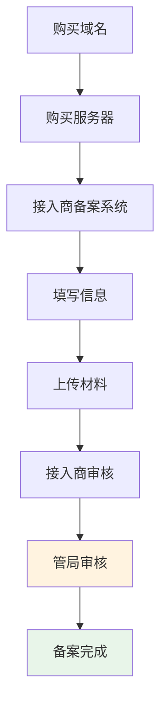

# 15.4 法律合规实践 🔴

> **阅读完本节后，你将会收获：**
> - 理解法律合规的重要性
> - 掌握隐私政策的编写要点
> - 了解用户协议的基本内容
> - 学会 ICP 备案的流程

> 法律合规不是可选项，而是必修课。合规是产品长期运营的基石。

---

## 为什么需要法律合规

互联网产品涉及用户数据和商业行为，必须遵守相关法律。

| 风险 | 后果 |
|------|------|
| 违反数据保护法 | 巨额罚款、服务下架 |
| 缺少用户协议 | 法律纠纷风险 |
| 未备案网站 | 在中国大陆被封禁 |
| 侵犯用户隐私 | 声誉损失、用户流失 |

::: tip 合规的重要性

不要等被举报了才想起来合规。提前做好合规工作，避免后续风险和整改成本。

:::

---

## 隐私政策

隐私政策说明如何收集、使用、存储和保护用户数据。

### 何时需要隐私政策

收集以下任何数据时都需要隐私政策：
- 邮箱地址
- 用户行为数据（如统计追踪）
- 个人身份信息
- 位置信息
- Cookie 和类似技术

### 隐私政策核心内容

| 内容 | 说明 |
|------|------|
| **数据收集** | 说明收集哪些数据及目的 |
| **数据使用** | 说明如何使用收集的数据 |
| **数据存储** | 说明数据存储位置和期限 |
| **数据共享** | 说明是否与第三方共享数据 |
| **用户权利** | 说明用户的访问、修改、删除权利 |
| **Cookie 政策** | 说明 Cookie 使用情况 |
| **联系方式** | 提供问题咨询渠道 |

### 隐私政策示例结构

```markdown
# 隐私政策

## 1. 收集的信息
- 账户信息（邮箱、用户名）
- 使用数据（访问日志、功能使用情况）

## 2. 信息使用
- 提供和改进服务
- 发送重要通知
- 分析产品使用情况

## 3. 信息存储
- 数据存储在 [国家/地区]
- 数据保留期限为 [时长]

## 4. 信息共享
我们不会出售您的个人信息。
- 服务提供商：用于托管和分析
- 法律要求：配合法律调查

## 5. 您的权利
- 访问和更新您的信息
- 删除您的账户
- 撤销同意

## 6. Cookie 使用
- 我们使用 Cookie 来改善用户体验
- 您可以通过浏览器设置控制 Cookie

## 7. 儿童隐私
- 我们的服务面向 13 岁以上用户
- 我们不会故意收集儿童信息

## 8. 政策更新
- 我们可能会更新本政策
- 重大变更会通过邮件通知

## 9. 联系我们
如有问题，请联系：[邮箱]
```

### 隐私政策模板生成工具

| 工具 | 链接 |
|------|------|
| Privacy Policy Generator | privacypolicygenerator.info |
| Termly | termly.io/products/privacy-policy-generator |
| FreePrivacyPolicy | freeprivacypolicy.com |

::: tip GDPR 要求

如果服务欧盟用户，隐私政策必须符合 GDPR 要求：
- 明确的数据处理依据
- 用户的数据权利
- 数据保护官联系方式
- 数据泄露通知机制

:::

---

## 用户协议

用户协议（Terms of Service）定义服务使用的法律条款。

### 用户协议核心内容

| 内容 | 说明 |
|------|------|
| **服务描述** | 说明提供的服务范围 |
| **用户责任** | 用户使用规范和禁止行为 |
| **内容责任** | 用户生成内容的责任归属 |
| **知识产权** | 各方的知识产权归属 |
| **服务变更** | 服务修改、暂停或终止的权利 |
| **免责声明** | 责任限制和免责条款 |
| **争议解决** | 争议处理方式和管辖法律 |

### 用户协议示例要点

```markdown
# 用户协议

## 1. 服务说明
- 我们提供 [服务描述]
- 我们保留随时修改服务的权利

## 2. 使用规范
您同意不会：
- 上传非法或有害内容
- 冒充他人或实体
- 干扰或破坏服务运行

## 3. 内容责任
- 您对您发布的内容负责
- 我们有权删除违规内容
- 我们不对用户内容承担连带责任

## 4. 知识产权
- 服务代码归我们所有
- 您保留您内容的所有权
- 使用服务即授予我们展示您内容的权利

## 5. 免责声明
- 服务按"现状"提供，不提供保证
- 我们不对使用后果承担责任

## 6. 服务终止
- 我们可随时暂停或终止您的账户
- 您也可以随时删除账户

## 7. 争议解决
- 争议通过协商解决
- 管辖法律：[国家/地区]

最后更新：[日期]
```

---

## ICP 备案

在中国大陆托管的服务器必须进行 ICP 备案。

### 何时需要 ICP 备案

| 服务器位置 | 是否需要备案 |
|-----------|-------------|
| 中国大陆 | 是 |
| 中国香港、澳门 | 否 |
| 其他国家/地区 | 否 |

### 备案类型

| 类型 | 说明 | 适用对象 |
|------|------|---------|
| **ICP 备案** | 基础备案 | 所有大陆网站 |
| **公安备案** | 公安机关备案 | 部分省市要求 |
| **经营性备案** | 经营性网站 | 有偿服务网站 |

### 备案流程



### 备案所需材料

| 材料 | 说明 |
|------|------|
| **身份证** | 个人备案需要身份证正反面 |
| **营业执照** | 企业备案需要营业执照 |
| **核验照片** | 网站负责人核验照片 |
| **备案承诺书** | 签署备案承诺书 |
| **域名证书** | 域名注册证书 |

### 备案时间

| 阶段 | 时间 |
|------|------|
| 接入商初审 | 1-2 个工作日 |
| 管局审核 | 7-20 个工作日 |
| 总计 | 约 2-4 周 |

::: tip 备案注意事项

1. 备案期间网站可能无法访问
2. 备案信息要真实准确
3. 信息变更需要及时更新
4. 备案号需要放在网站底部

:::

---

## 合规检查清单

上线前完成以下合规检查：

### 隐私和数据

- [ ] 有完整的隐私政策页面
- [ ] 隐私政策链接在网站底部显著位置
- [ ] 说明收集的数据类型和用途
- [ ] 提供数据访问和删除机制
- [ ] 符合 GDPR（如服务欧盟用户）

### 用户协议

- [ ] 有完整的用户协议
- [ ] 用户注册前必须同意协议
- [ ] 明确内容责任归属
- [ ] 包含免责声明

### 中国大陆特定

- [ ] 完成 ICP 备案
- [ ] 备案号放在网站底部
- [ ] 服务器在大陆且有备案
- [ ] 内容符合中国法律法规

### 其他

- [ ] 有联系方式页面
- [ ] Cookie 使用说明（如适用）
- [ ] 年龄限制（如适用）
- [ ] 投诉举报渠道

---

## 常见问题

### Q1: 个人项目也需要隐私政策吗？

如果你收集任何用户数据（包括统计追踪），就需要隐私政策。纯静态展示网站可能不需要。

### Q2: 可以复制别人的隐私政策吗？

不推荐。不同服务收集的数据不同，应该根据实际情况编写。可以用生成器作为起点，然后定制化。

### Q3: 服务器在海外需要 ICP 备案吗？

不需要。但如果服务中国大陆用户，访问速度可能受影响。

### Q4: GDPR 违规有什么后果？

严重违反 GDPR 可能面临全球年营业额 4% 或 2000 万欧元的罚款（取较高者）。

---

## 本节核心要点

- ✅ 法律合规是产品长期运营的基石
- ✅ 隐私政策说明数据收集和使用方式
- ✅ 用户协议定义服务使用规范
- ✅ 中国大陆服务器必须 ICP 备案
- ✅ 合规检查清单确保不遗漏关键项
- ✅ 提前做好合规，避免后续风险

第十五章完成！接下来开始第十六章：用户反馈与产品迭代。

---

## 相关内容

- 前置：[15.3 Umami 统计部署](./03-umami.md)
- 详见：[第十六章 用户反馈与产品迭代](../16-user-feedback-iteration/index.md)
