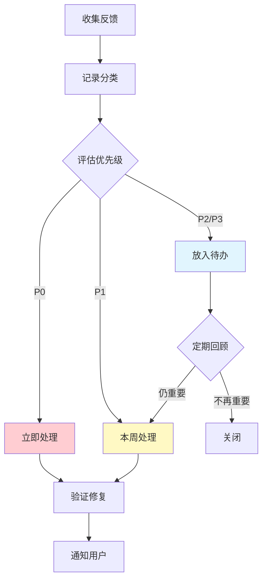

# 16.3 反馈分类与优先级 🟡

> **阅读完本节后，你将会收获：**
> - 掌握用户反馈的分类方法
> - 学会评估反馈的优先级
> - 了解 RICE 评分模型
> - 建立反馈管理流程

> 收集了一堆反馈后，如何判断先做哪个？影响范围和严重程度是两个关键维度。

---

## 反馈分类

用户反馈五花八门，需要分类整理。

### 按类型分类

| 类型 | 说明 | 示例 |
|------|------|------|
| **Bug 报告** | 功能错误或异常 | "登录按钮没反应" |
| **功能请求** | 希望新增功能 | "能否加入导出功能" |
| **体验问题** | 使用不顺畅 | "找不到设置在哪里" |
| **性能问题** | 速度或卡顿 | "页面加载太慢" |
| **内容相关** | 文案、设计 | "这个词用错了" |
| **其他** | 无法归类 | "一般般" |

### 按紧急程度分类

| 程度 | 说明 | 响应时间 |
|------|------|---------|
| **紧急** | 系统崩溃、数据丢失 | 立即 |
| **高** | 核心功能无法使用 | 24 小时内 |
| **中** | 影响部分用户 | 本周内 |
| **低** | 小问题或建议 | 有时间时 |

### 按用户价值分类

| 价值 | 说明 |
|------|------|
| **核心用户** | 高频使用或付费用户 |
| **活跃用户** | 经常使用但不付费 |
| **新用户** | 刚开始使用 |
| **流失用户** | 已停止使用 |

---

## 优先级评估框架

用两个维度判断优先级：影响范围和严重程度。

### 影响范围 × 严重程度矩阵

```
严重程度
高 │ [P0] 紧急修复    [P1] 高优先级
   │ ┌─────────────┬─────────────┐
中 │ │             │             │
   │ [P2] 中优先级  [P3] 低优先级  │
低 │ │             │             │
   │ └─────────────┴─────────────┘
   └──────────────────────────────
       小          大
          影响范围
```

| 优先级 | 说明 | 示例 |
|--------|------|------|
| **P0 紧急** | 影响大量用户，系统不可用 | 登录功能失效 |
| **P1 高** | 影响大量用户，核心功能受影响 | 支付失败 |
| **P2 中** | 影响部分用户，有替代方案 | 某浏览器显示异常 |
| **P3 低** | 影响小，不影响使用 | 颜色不好看 |

---

## RICE 评分模型

RICE 是一个更全面的优先级评估方法。

### RICE 组成部分

| 因素 | 说明 | 评分标准 |
|------|------|---------|
| **Reach** 触达 | 多少用户受影响 | 用户数/月 |
| **Impact** 影响 | 对用户的影响程度 | 1-3 分 |
| **Confidence** 信心 | 评估的把握程度 | % |
| **Effort** 工作量 | 需要的时间和资源 | 人月 |

### RICE 计算公式

```
RICE = (Reach × Impact × Confidence) / Effort
```

### 评分示例

| 功能 | Reach | Impact | Confidence | Effort | RICE |
|------|--------|--------|-----------|--------|------|
| 导出功能 | 100 | 3 | 80% | 2 | 120 |
| 深色模式 | 500 | 1 | 100% | 3 | 167 |
| 修复登录 Bug | 1000 | 3 | 100% | 1 | 3000 |

根据 RICE 分数排序：修复登录 Bug > 深色模式 > 导出功能

::: tip RICE 的优势

RICE 考虑了多个维度，避免了只凭直觉做决策。它让你把假设和数据结合起来。

:::

---

## ICE 简化评分

如果 RICE 太复杂，可以使用简化版 ICE。

### ICE 评分

| 因素 | 说明 | 评分 |
|------|------|------|
| **Impact** 影响 | 对用户的价值 | 1-10 |
| **Confidence** 信心 | 数据支持程度 | 1-10 |
| **Ease** 难度 | 实现难度 | 1-10 |

```
ICE = (Impact + Confidence + Ease) / 3
```

### 评分示例

| 功能 | Impact | Confidence | Ease | ICE |
|------|--------|-----------|------|-----|
| 导出功能 | 8 | 7 | 3 | 6 |
| 深色模式 | 5 | 10 | 8 | 7.7 |
| 修复 Bug | 10 | 10 | 5 | 8.3 |

---

## 反馈管理流程

建立系统化的反馈处理流程。



### 记录反馈

使用工具记录和追踪反馈：

| 工具 | 适用场景 |
|------|---------|
| **Notion/Airtable** | 简单的反馈列表 |
| **GitHub Issues** | 技术产品 |
| **专业工具** | Intercom, UserVoice |
| **自建** | 完全自定义 |

### 反馈记录模板

| 字段 | 说明 |
|------|------|
| ID | 唯一标识 |
| 类型 | Bug/Feature/其他 |
| 描述 | 问题描述 |
| 用户 | 反馈用户（可匿名） |
| 影响范围 | 受影响用户数 |
| 严重程度 | 高/中/低 |
| RICE 分数 | 优先级分数 |
| 状态 | 待处理/进行中/已完成 |

---

## 决策权衡

有限资源下，需要做取舍。

### 取舍原则

| 原则 | 说明 |
|------|------|
| **核心优先** | 核心功能优先于边缘功能 |
| **修复优先** | 修复 Bug 优先于新功能 |
| **用户价值** | 高价值用户反馈优先 |
| **成本效益** | 小投入大回报优先 |
| **战略一致性** | 与产品方向一致优先 |

### 学会说"不"

| 场景 | 回应 |
|------|------|
| 不是目标用户 | "这不在我们当前计划内" |
| 与方向不符 | "感谢建议，但我们的重点是..." |
| 资源有限 | "这个建议很好，我们会考虑" |
| 已有计划 | "我们正在开发类似功能" |

---

## 常见问题

### Q1: 所有反馈看起来都重要怎么办？

用 RICE 或 ICE 框架客观评分，而不是凭直觉。数据会让优先级清晰起来。

### Q2: 用户催促什么时候实现？

诚实回答。不要给承诺，但可以说"我们正在评估，会在后续版本中考虑"。

### Q3: 忽略用户反馈会得罪他们吗？

不一定。关键是回应。即使不实现，也要解释原因，感谢他们的建议。

### Q4: 如何避免被用户牵着走？

保持产品愿景。用户反馈很重要，但你是产品负责人，不是所有反馈都要采纳。

---

## 本节核心要点

- ✅ 反馈需要分类整理
- ✅ 优先级 = 影响范围 × 严重程度
- ✅ RICE 是全面的优先级评估方法
- ✅ 建立系统化的反馈管理流程
- ✅ 学会说"不"是产品负责人的必修课
- ✅ 数据驱动的决策减少争议

优先级确定后，可以通过用户访谈深入了解问题。

---

## 相关内容

- 前置：[16.2 收集反馈的渠道](./02-feedback-channels.md)
- 详见：[16.4 用户访谈技巧](./04-user-interviews.md)
