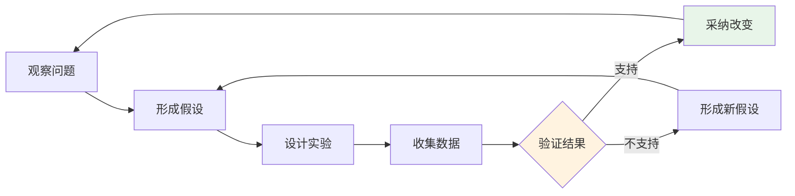
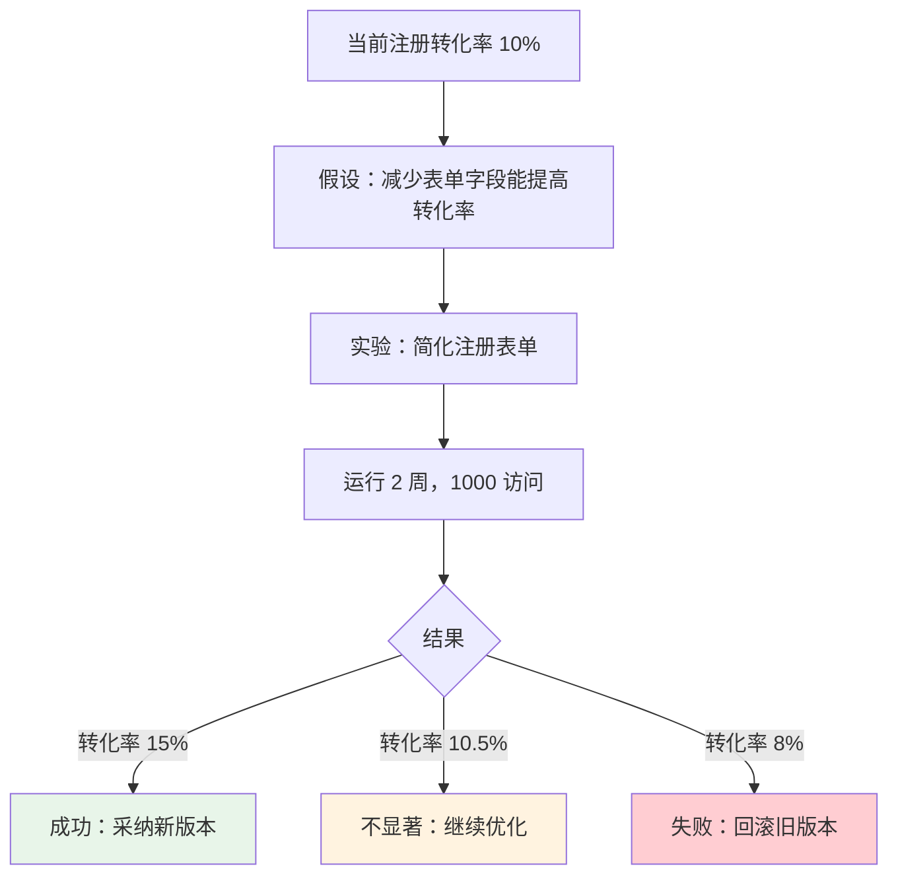

# 16.5 数据驱动决策 🟡

> **阅读完本节后，你将会收获：**
> - 理解数据和反馈的互补关系
> - 掌握核心数据指标体系
> - 学会建立假设并验证
> - 了解数据驱动的决策框架

> 数据告诉你"发生了什么"，用户反馈告诉你"为什么发生"。两者结合才能做出更好的决策。

---

## 数据与反馈的互补

定性反馈和定量数据各有价值，结合使用效果最好。

| 数据（定量） | 反馈（定性） |
|-------------|-------------|
| 告诉你 What | 告诉你 Why |
| 客观可测量 | 主观但深入 |
| 大规模覆盖 | 小样本深度 |
| 趋势和模式 | 背景和原因 |

### 互补示例

| 数据显示 | 反馈揭示 | 行动 |
|---------|---------|------|
| 注册页流失率高 | "表单太长了" | 简化表单 |
| 某功能使用率低 | "找不到入口" | 优化入口设计 |
| 移动端留存低 | "手机上按钮太小" | 优化移动端体验 |

---

## 数据指标体系

建立合理的数据指标体系是数据驱动的基础。

### 北极星指标

北极星指标是衡量产品核心价值的关键指标。

| 产品类型 | 北极星指标示例 |
|---------|---------------|
| SaaS | 月活跃用户（MAU） |
| 电商 | 订单转化率 |
| 内容平台 | 内容消费时长 |
| 工具产品 | 功能使用率 |

::: tip 好的北极星指标

好的北极星指标应该：
- 反映产品核心价值
- 可衡量
- 可行动
- 前置指标（而非滞后指标）

:::

### 核心指标分类

| 类别 | 指标 | 说明 |
|------|------|------|
| **获取** | 访问量、注册量 | 用户从哪里来 |
| **激活** | 首次使用关键功能 | 用户是否发现价值 |
| **留存** | 次日/7日/30日留存 | 用户是否持续使用 |
| **收入** | 付费率、ARPU | 商业价值 |
| **推荐** | NPS、分享率 | 用户是否愿意推荐 |

### 主要指标 vs 虚荣指标

| 主要指标 | 虚荣指标 |
|---------|---------|
| 留存率 | 总注册用户数 |
| 转化率 | 页面浏览总量 |
| 活跃用户 | 累计下载量 |
| 功能使用率 | 社交媒体粉丝数 |

::: tip 判断标准

如果一个数据让你不知道该做什么，那可能是虚荣指标。主要指标能指导行动。

:::

---

## 假设驱动的方法

数据驱动的核心是建立假设并验证。

### 假设验证循环



### 假设陈述格式

使用清晰的格式陈述假设：

```
如果 [改变 X]
那么 [预期结果 Y]
因为 [理由 Z]
```

### 假设示例

| 假设 | 验证方法 |
|------|---------|
| 如果简化注册表单，那么注册转化率会提高 20%，因为用户更愿意完成简短流程 | A/B 测试 |
| 如果在首页添加演示视频，那么激活率会提高，因为用户能更快理解产品价值 | 对比实验 |

---

## 实验设计

好的实验能产生可信的数据。

### A/B 测试

A/B 测试是比较两个版本效果的方法。

| 要素 | 说明 |
|------|------|
| **对照组** | 现有版本（A） |
| **实验组** | 新版本（B） |
| **单一变量** | 只改变一个因素 |
| **随机分配** | 用户随机分组 |
| **足够样本** | 确保统计显著性 |

### 实验前检查

| 检查项 | 说明 |
|------|------|
| **明确目标** | 想要改进什么指标 |
| **测量基线** | 当前数据水平 |
| **计算样本量** | 需要多少用户参与 |
| **定义成功** | 什么情况下算成功 |

### 实验示例



---

## 数据分析工具

选择合适的工具进行分析。

| 工具类型 | 适用场景 | 示例 |
|---------|---------|------|
| **网站分析** | 流量、用户行为 | Umami, Google Analytics |
| **产品分析** | 功能使用、留存 | Amplitude, Mixpanel |
| **数据库查询** | 自定义分析 | SQL, BI 工具 |
| **A/B 测试** | 实验管理 | Optimizely, 自建 |

### 简单分析示例

```sql
-- 计算次日留存率
SELECT
  DATE(first_visit) as cohort_date,
  COUNT(DISTINCT user_id) as users,
  COUNT(DISTINCT CASE WHEN next_visit = first_visit + INTERVAL '1 day' THEN user_id END) * 100.0 / COUNT(DISTINCT user_id) as retention_rate
FROM user_activities
GROUP BY DATE(first_visit)
ORDER BY cohort_date DESC;
```

---

## 数据驱动决策陷阱

避免常见的分析误区。

| 陷阱 | 说明 | 避免 |
|------|------|------|
| **相关即因果** | A 和 B 相关不代表 A 导致 B | 设计实验验证因果关系 |
| **选择性偏差** | 只看部分数据 | 确保样本代表性 |
| **短期主义** | 只看短期数据 | 关注长期趋势 |
| **数据崇拜** | 完全依赖数据 | 结合直觉和反馈 |
| **过度分析** | 分析瘫痪 | 采取行动 |

---

## 案例分析：Super Daily

一个假设驱动的改进案例。

### 观察

数据显示注册页流失率高达 70%。

### 假设

注册表单太长，要求信息太多，导致用户中途放弃。

### 实验

1. 简化注册表单，只保留邮箱
2. 其余信息注册后收集
3. A/B 测试对比

### 结果

| 版本 | 转化率 |
|------|--------|
| 原版本（7 字段） | 30% |
| 新版本（1 字段） | 55% |

### 行动

采纳新版本，注册转化率提升 83%。

---

## 常见问题

### Q1: 数据量小怎么做分析？

小数据量时，定性反馈更重要。每个用户的反馈都更有价值，深入访谈比大规模统计更有效。

### Q2: 数据和反馈矛盾怎么办？

优先相信数据，但用访谈理解原因。数据可能揭示了你不注意到的模式。

### Q3: 怎么知道样本量够了？

对于 A/B 测试，可以使用样本量计算器。对于定性研究，5-10 次访谈通常足够。

### Q4: 没有数据团队怎么办？

可以从简单的指标开始。用 Umami 等现成工具，不需要复杂的数据基础设施也能开始数据驱动。

---

## 本节核心要点

- ✅ 数据显示 What，反馈显示 Why
- ✅ 建立核心指标体系，区分主要和虚荣指标
- ✅ 假设驱动：形成假设 → 设计实验 → 验证结果
- ✅ A/B 测试是比较版本效果的有效方法
- ✅ 避免相关即因果等分析陷阱
- ✅ 小团队也可以做数据驱动

数据驱动决策后，需要考虑迭代节奏。

---

## 相关内容

- 前置：[16.4 用户访谈技巧](./04-user-interviews.md)
- 前置：[15.3 Umami 统计部署](../15-seo-analytics/03-umami.md)
- 详见：[16.6 迭代节奏管理](./06-iteration-pace.md)
