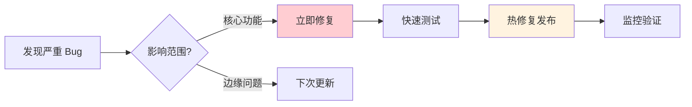
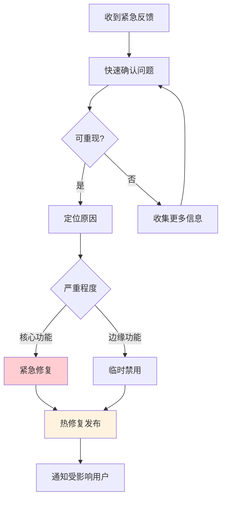

# 16.6 迭代节奏管理 🟢

> **阅读完本节后，你将会收获：**
> - 理解不同类型的更新节奏
> - 掌握分层更新策略
> - 了解灰度发布的方法
> - 学会管理用户沟通

> 一开始你可能想每天都更新，觉得这样显得积极。但频繁更新会让用户疲惫，合理的节奏更重要。

---

## 更新节奏的问题

更新太快或太慢都有问题。

| 更新太快 | 更新太慢 |
|---------|---------|
| 用户疲惫 | 竞争超越 |
| 引入新 Bug | 需求不被满足 |
| 难以稳定 | 失去用户兴趣 |
| 文档跟不上 | 缺少反馈循环 |

::: tip 找到平衡点

好的更新节奏是既能快速响应用户需求，又能保持产品稳定。

:::

---

## 三层更新策略

将更新分为不同层级，每层有自己的节奏。

### 更新层级

| 层级 | 内容 | 频率 | 风险 |
|------|------|------|------|
| **热修复** | 紧急 Bug 修复 | 随时 | 低 |
| **小更新** | 小功能、优化 | 每周 | 中 |
| **大版本** | 新功能、重构 | 每月 | 高 |

### 热修复流程



---

## 灰度发布

新功能先向部分用户开放，逐步扩大。

### 灰度发布的好处

| 好处 | 说明 |
|------|------|
| **降低风险** | 问题只影响部分用户 |
| **收集反馈** | 真实环境验证 |
| **逐步放量** | 稳定后全量发布 |

### 灰度发布策略

| 策略 | 说明 | 适用场景 |
|------|------|---------|
| **白名单** | 指定特定用户 | 内部测试、友好用户 |
| **百分比** | 随机 x% 用户 | 大规模验证 |
| **随机分桶** | A/B 测试 | 功能对比 |
| **条件触发** | 满足条件才显示 | 风险控制 |

### 功能开关实现

```typescript
// 功能开关配置
const FEATURES = {
  newDashboard: {
    enabled: true,
    rollout: 10, // 10% 用户
    whitelist: ['user@example.com'], // 白名单
  },
};

export function isFeatureEnabled(feature: string, user: User): boolean {
  const config = FEATURES[feature];
  if (!config?.enabled) return false;

  // 白名单检查
  if (config.whitelist?.includes(user.email)) return true;

  // 灰度百分比
  const hash = hashString(user.id);
  return (hash % 100) < config.rollout;
}

// 使用
{isFeatureEnabled('newDashboard', user) && <NewDashboard />}
```

---

## 用户沟通

更新时如何与用户沟通很重要。

### 沟通渠道

| 渠道 | 适用内容 |
|------|---------|
| **应用内公告** | 重要更新 |
| **邮件通知** | 重大变化 |
| **博客/更新日志** | 详细说明 |
| **社交媒体** | 轻量更新 |

### 更新通知示例

```markdown
# 🎉 新功能：数据导出

我们听到了您的反馈，现在可以导出您的数据了！

### 如何使用
1. 进入设置页面
2. 点击"导出数据"
3. 选择格式（CSV/JSON）

### 下一步
我们正在开发更多导出选项，敬请期待。

有什么建议？欢迎随时反馈！
```

### 变更管理

| 变更类型 | 沟通策略 |
|---------|---------|
| **新增功能** | 强调价值，教用户使用 |
| **功能移除** | 提前通知，解释原因 |
| **界面变化** | 对比图，引导适应 |
| **Bug 修复** | 简单告知已解决 |

---

## 反馈速度层级

用户反馈也需要分层处理。

| 优先级 | 响应时间 | 处理方式 |
|--------|---------|---------|
| **紧急** | 4 小时内 | 立即调查、临时方案 |
| **高** | 24 小时内 | 计划修复、告知用户 |
| **中** | 本周内 | 排入待办 |
| **低** | 有时间时 | 记录并评估 |

### 紧急问题处理



---

## 迭代节奏模式

不同阶段适合不同的迭代节奏。

| 阶段 | 节奏 | 重点 |
|------|------|------|
| **早期** | 快速迭代 | 验证假设 |
| **成长期** | 稳定节奏 | 功能扩张 |
| **成熟期** | 持续优化 | 体验提升 |

### 早期快速迭代

- 一周一个小版本
- 关注核心功能
- 快速验证假设
- 不过度优化

### 成长期稳定节奏

- 两周一个小版本
- 每月一个大版本
- 质量与速度并重
- 开始注重稳定性

---

## 常见问题

### Q1: 每天更新是不是太频繁？

对于用户来说可能太频繁。建议把小改动积累到一起，每周发布一次。

### Q2: 如何处理强制更新？

对于严重安全问题或架构变更：
- 提前通知用户
- 给出迁移时间表
- 提供迁移指南
- 保留一定的过渡期

### Q3: 用户抱怨更新太多怎么办？

这可能意味着：
- 功能不够稳定
- 变化太频繁
- 缺少版本说明

相应调整：减少频率、提高质量、改善沟通。

### Q4: 如何平衡新功能和 Bug 修复？

建议 80/20 原则：
- 80% 精力在稳定性和 Bug 修复
- 20% 精力在新功能开发

---

## 本节核心要点

- ✅ 更新太快太慢都有问题
- ✅ 使用三层更新策略：热修复、小更新、大版本
- ✅ 灰度发布降低新功能风险
- ✅ 及时告知用户更新内容
- ✅ 用户反馈按优先级处理
- ✅ 不同阶段适合不同的迭代节奏

迭代节奏确定后，建立持续迭代的文化。

---

## 相关内容

- 前置：[16.5 数据驱动决策](./05-data-driven-decisions.md)
- 详见：[16.7 持续迭代文化](./07-iteration-culture.md)
