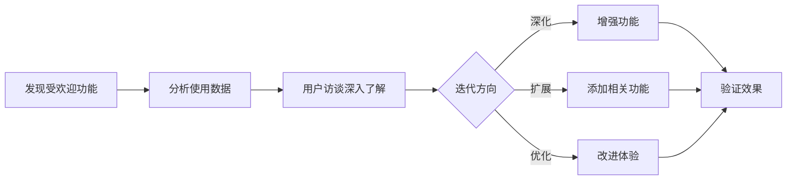
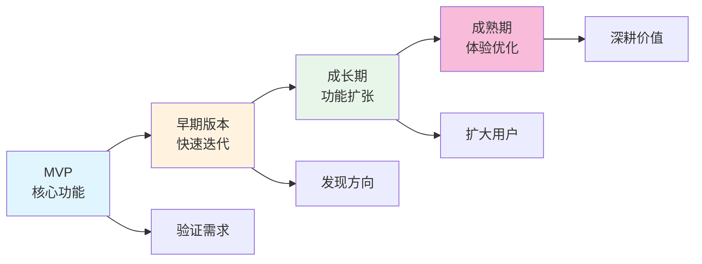

# 16.7 持续迭代文化 🟡

> **阅读完本节后，你将会收获：**
> - 理解产品是持续进化的过程
> - 掌握加强受欢迎功能的方法
> - 学会识别和放弃没人用的功能
> - 建立"永远在 Beta"的思维方式

> 产品上线的那一天，不是结束，而是真正开始。没有一次就能做到完美的产品，都是一步步迭代出来的。

---

## 永远在 Beta 的思维

好的产品永远是"进行中"的状态。

### Beta 的含义

| 传统理解 | 现代 Beta 文化 |
|---------|---------------|
| 测试版本 | 持续改进 |
| 临时状态 | 永久心态 |
| 不稳定 | 快速迭代 |
| 会结束 | 不会结束 |

::: tip 永远在 Beta

"永远在 Beta"不是产品不完整，而是一种心态——始终相信有改进空间，保持学习和调整。

:::

### 好处

| 好处 | 说明 |
|------|------|
| **降低完美主义压力** | 不需要一次做到完美 |
| **鼓励快速尝试** | 小步快跑，快速验证 |
| **保持谦逊** | 承认不知道所有答案 |
| **持续学习** | 从反馈中不断进步 |

---

## 加强受欢迎的

资源有限，要把精力放在用户真正喜欢的地方。

### 识别受欢迎的功能

| 信号 | 说明 |
|------|------|
| **高使用率** | 功能使用频率高 |
| **正面反馈** | 用户主动提及 |
| **留存贡献** | 使用该功能的用户留存更好 |
| **付费意愿** | 用户愿意为此付费 |

### 加强策略

| 策略 | 说明 |
|------|------|
| **深化功能** | 做得更强大、更完善 |
| **相关扩展** | 添加相关功能 |
| **优化体验** | 让功能更好用 |
| **宣传推广** | 让更多用户知道 |

### 示例

---

## 放弃没人用的

保留不需要的功能会分散精力和复杂化产品。

### 识别没人用的功能

| 信号 | 说明 |
|------|------|
| **低使用率** | 很少人用 |
| **零反馈** | 从未被提及 |
| **高支持成本** | 问题多但价值小 |
| **战略偏移** | 与产品方向不符 |

### 放弃策略

| 策略 | 说明 | 适用场景 |
|------|------|---------|
| **直接移除** | 删除功能 | 使用率极低 |
| **逐步淘汰** | 停止推广，慢慢移除 | 部分用户依赖 |
| **替换** | 用更好的方案替代 | 有替代选择 |
| **拆分** | 变成独立产品或插件 | 小众但有价值 |

::: tip 移除前的准备

移除功能前：
1. 分析使用数据，确认真的低使用率
2. 提前通知受影响的用户
3. 提供替代方案或迁移指南
4. 监控移除后的反馈

:::

---

## 小步快跑原则

持续迭代的核心是小步快跑。

### 小步快跑的优势

| 优势 | 说明 |
|------|------|
| **降低风险** | 每次改动小，问题易定位 |
| **快速反馈** | 更快知道方向对不对 |
| **心理轻松** | 不需要"憋大招" |
| **持续进步** | 积少成多 |

### 如何实施

| 实践 | 说明 |
|------|------|
| **分解任务** | 大功能拆成小步骤 |
| **限制范围** | 每个版本聚焦少数改动 |
| **频繁发布** | 定期发布小版本 |
| **快速验证** | 每次改动都验证效果 |

---

## 建立迭代文化

如果是团队，需要建立支持迭代的文化。

| 文化要素 | 说明 |
|---------|------|
| **欢迎反馈** | 反馈是礼物，不是批评 |
| **允许失败** | 快速失败比不尝试好 |
| **数据说话** | 用数据做决策，减少争论 |
| **持续学习** | 每个迭代都是学习机会 |
| **用户中心** | 始终以用户价值为导向 |

---

## 长期主义视角

持续迭代需要长期主义。

| 短期思维 | 长期思维 |
|---------|---------|
| 追求爆款 | 持续改进 |
| 快速扩张 | 稳健增长 |
| 取悦所有人 | 服务核心用户 |
| 一夜成功 | 日积月累 |

### 长期主义的实践

| 实践 | 说明 |
|------|------|
| **积累信任** | 长期提供稳定可靠的服务 |
| **深挖价值** | 做深做透，而非广泛浅尝 |
| **维护关系** | 与用户建立长期关系 |
| **投资基础** | 在基础设施和质量上投入 |

---

## 产品进化示例

一个产品从初始到成熟的进化过程。

---

## 全教程核心理念总结

贯穿整个教程的核心思想。

### 问题定义能力

> "清楚地定义问题，比快速地解决问题更重要。"

### AI 辅助开发

> "AI 是你的助手，不是替代。你仍然需要理解问题、设计方案、验证结果。"

### 产品思维

> "先验证需求，再开发功能。不是你觉得有用，是用户觉得有用。"

### 持续迭代

> "产品上线不是结束，而是开始。通过反馈、数据、理解，不断调整和改进。"

---

## 常见问题

### Q1: 什么时候停止迭代？

产品迭代没有终点。但可以调整节奏：
- 早期：快速迭代，验证假设
- 成熟期：稳定节奏，持续优化

### Q2: 如何避免过度迭代？

关注核心指标。如果新改动没有带来改进，停下来重新思考方向。

### Q3: 用户想要的都要做吗？

不是。用户提需求，你做决策。收集反馈、分析数据、判断优先级，然后决定做不做。

### Q4: 长期主义如何应对短期压力？

区分核心和边缘。核心功能坚持长期主义，边缘功能可以灵活应对。

---

## 本节核心要点

- ✅ 产品是持续进化的，永远在 Beta
- ✅ 加强受欢迎的功能，放弃没人用的
- ✅ 小步快跑是持续迭代的最佳方式
- ✅ 建立欢迎反馈、允许失败的文化
- ✅ 长期主义比短期成功更重要
- ✅ 产品上线是真正的开始

---

## 结语

恭喜你完成了全部 16 章的学习！

从环境搭建到产品上线，从 PRD 编写到持续迭代，你已经掌握了 AI 辅助产品开发的完整流程。现在，去实现你的想法吧！

记住：
- **定义清楚问题**，比快速解决问题更重要
- **AI 是助手**，你仍然需要主导方向
- **先验证再开发**，避免做没人要的东西
- **持续迭代改进**，产品上线是真正开始

祝你的产品成功！🚀

---

## 相关内容

- 前置：[16.6 迭代节奏管理](./06-iteration-pace.md)
- 全书回顾：[进阶版目录](../index.md)
