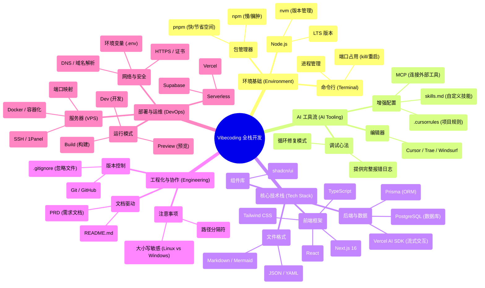

# 进阶篇：全栈实战

## 从会写代码到能做产品

如果你翻开这本进阶教程的目录，会看到满眼的技术名词：环境搭建、包管理器、数据库、部署……这看起来很像传统编程教育的内容列表。但我想先告诉你：这些不是重点，只是工具。

在过去十年里，编程教育陷入了一个巨大的误区：一上来就教你语法、数据结构、算法，好像掌握了这些就能做产品。但实际上，从"会写代码"到"能做产品"，中间隔着巨大的鸿沟。

更麻烦的是，很多人以为做软件就是写代码。但事实恰恰相反——**代码从来不是软件的出发点，而是解决方案的最后一个环节**。

任何一个软件项目，都始于一个**问题**。它可以是一个商业问题（比如帮餐厅减少排队时间）、一个科学问题（比如处理大量实验数据）、一个个人问题（比如管理自己的阅读清单），甚至是一个虚构的问题（比如练习某种技术）。

为了解决这个问题，你需要先形成一个**解决方案**。这个方案包含很多维度：需要设计什么流程、制定什么规则、分配什么角色、怎么协调各方。这些才是项目的核心。

只有当方案中某些部分需要自动化、规模化、或者超越人力极限时，你才会想到：**"这部分可以用软件来实现"**。这时候，代码才开始登场。

所以，**写代码是在相当中后期的阶段才需要做的事情**。

## 真正的变革

但时代的钟摆已经摆动到了新的位置。

在 AI 编程工具出现之前，从"想法"到"产品"之间，横亘着一道名为"实现能力"的巨大鸿沟。你有想法，但你不会写代码，或者写出来的代码质量不够高，于是想法就止步于想法。

现在，这道鸿沟正在被填平。

这就像摄影技术的发展：以前你需要懂光圈、快门、对焦的复杂原理，才能拍出一张像样的照片。现在手机相机自动帮你处理了所有技术细节，你只需要关注构图和内容——你想拍什么，怎么拍才好看。

AI 编程工具也是如此。它们帮你处理了代码细节，你只需要关注产品本身——**你想解决什么问题，如何解决**。

这并不意味着你可以完全不懂技术。你仍然需要理解技术的原理和边界，就像你用手机拍照也需要知道"光线太暗会拍糊"。但你不需要死记硬背每一行代码的写法，就像你不需要知道手机相机的底层算法。

## 换个走法

在这本进阶教程里，你不会看到"从语法开始学编程"的传统路径。

相反，你会看到一条实干家的路径：从一个问题开始，形成一个解决方案，然后用 AI 工具把这个方案变成产品。

我用一种复盘笔记的方式，把每一章的序言写出来——它不是百科式的知识点堆砌，而是把当时的决策、踩坑、纠结、取舍都写清楚，让你先获得一条能走通的路径与心智模型。

### 一人军队

为了让你理解我们即将学到的这套路径的独特之处，有必要先看看现代软件开发的传统流程是怎样的。

**在大型互联网公司（俗称"大厂"），一个看似简单的功能上线，背后是一套完整而复杂的流程：**

**需求阶段**：产品经理撰写需求文档（PRD），组织需求评审会（PM、开发、测试一起讨论）。

**技术设计阶段**：后端和前端分别撰写技术方案，组织技术评审会（甚至上下游团队的开发也要参与）。

**开发阶段**：编码、单元测试、接口自测、前后端联调。

**测试阶段**：开发者自测通过后，"提测"交给QA团队，QA进行手动测试和自动化测试，发现Bug再打回给开发修复。

**上线阶段**：代码合并、预发环境验证、灰度发布（先给5%用户，再10%、50%，最后100%全量）。

**迭代阶段**：以两周为一个迭代周期，持续规划和交付新功能。

这套流程的好处是规范、可控、风险低。但问题是：慢、重、门槛高。一个功能从提出到上线，往往需要几周甚至几个月。而且每个环节都需要专人负责——产品经理、后端开发、前端开发、测试工程师……对于个人或小团队来说，这套流程几乎是不可复制的。

**而在 AI 时代，这套流程被压缩和重构了：**

**需求阶段**：你自己就是产品经理，写PRD让AI理解。

**技术设计阶段**：AI帮你生成技术方案，你只需要审核和调整。

**开发阶段**：AI帮你写代码，你只需要描述需求、检查结果。

**测试阶段**：AI帮你写测试用例，自动化执行。

**上线阶段**：一键部署到云平台，自动完成构建和发布。

**迭代阶段**：根据数据和反馈快速调整，以天甚至小时为单位迭代。

注意，这并不意味着流程消失了，而是很多环节被AI自动化了，或者说一个人可以兼任多个角色。你不需要写每一行代码，但你仍然需要理解每个环节在做什么，为什么这么做，出了问题怎么排查。

这就是本教程要教你的：**不是取代流程，而是掌握流程的核心，用AI提升效率**。

本篇以「从零基础到上线的避坑指南」为主线，带你用一条完整的产品交付流程串起全栈开发：

- **问题定义与方案设计**（第3章）：先写 PRD，明确要解决什么问题、如何解决
- **技术选型与环境准备**（第1-2章）：选择合适的技术栈，配置开发环境
- **产品实现**（第4-8章）：UI/UX 设计、数据存储、安全机制、自动化测试
- **发布与迭代**（第9-15章）：从本地到公网、从个人到团队、从上线到持续改进

在这条路径的终点，等待你的不是"成为程序员"，而是"成为一个能用产品解决问题的人"。

**代码是手段，不是目的**。你的目标是解决问题，创造价值，而代码只是帮你实现这个目标的工具之一。

在这个充满了不确定性、噪音与加速度的时代，过度思考往往是行动的敌人。不要等到代码完美无缺才开始做产品，不要等到看清了终局才开始起跑。

**在这个时代，想，都是问题；做，才是答案。**

::: tip 旧版进阶
如果你更想先阅读偏知识地图/知识陈列的旧版内容：前往 [进阶版（旧）](/Advanced-old/)。
:::

## 章节总览

| 章节 | 主题 | 状态 |
|---|---|---|
| 1 | [环境搭建、代码形态与包管理器](/Advanced/01-environment-setup/) | ✅ 序言可阅读 |
| 2 | [开发工具与 AI 调教](/Advanced/02-dev-tools-ai-tuning/) | ✅ 序言可阅读 |
| 3 | [PRD 与文档驱动开发](/Advanced/03-prd-doc-driven/) | ✅ 序言可阅读 |
| 4 | [代码运行状态与构建原理](/Advanced/04-build-and-runtime-modes/) | ✅ 序言可阅读 |
| 5 | [界面（UI）与交互（UX）](/Advanced/05-ui-ux/) | ✅ 序言可阅读 |
| 6 | [环境变量与安全机制](/Advanced/06-env-vars-security/) | ✅ 序言可阅读 |
| 7 | [数据持久化与数据库](/Advanced/07-data-persistence-database/) | ✅ 序言可阅读 |
| 8 | [功能测试流程与自动化脚本](/Advanced/08-testing-automation/) | ✅ 序言可阅读 |
| 9 | [Localhost 与公网访问](/Advanced/09-localhost-public-access/) | ✅ 序言可阅读 |
| 10 | [Git 版本控制与跨平台协作](/Advanced/10-git-collaboration/) | ✅ 序言可阅读 |
| 11 | [无服务器部署与 CI/CD 自动化](/Advanced/11-serverless-deploy-cicd/) | ✅ 序言可阅读 |
| 12 | [域名解析原理与网络接入](/Advanced/12-domain-dns/) | ✅ 序言可阅读 |
| 13 | [云服务器运维与项目部署](/Advanced/13-vps-ops-deploy/) | ✅ 序言可阅读 |
| 14 | [SEO、分享与数据统计](/Advanced/14-seo-analytics/) | ✅ 序言可阅读 |
| 15 | [用户反馈与产品迭代](/Advanced/15-user-feedback-iteration/) | ✅ 序言可阅读 |

## 知识点概览

